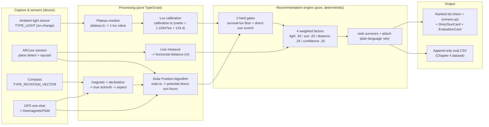
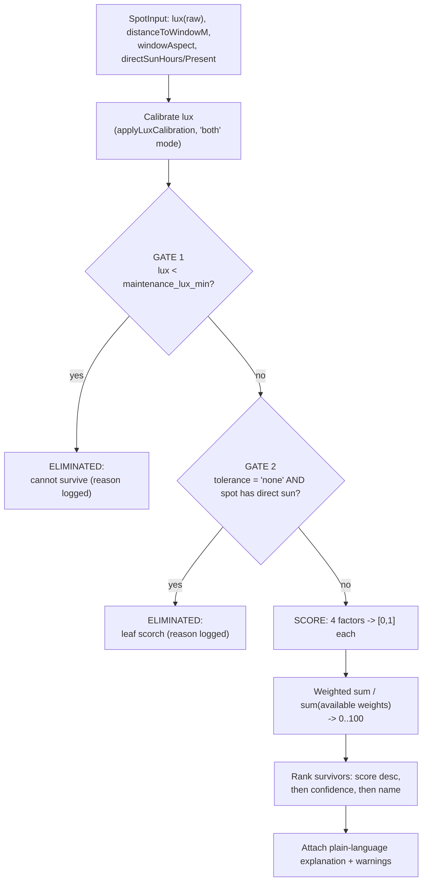
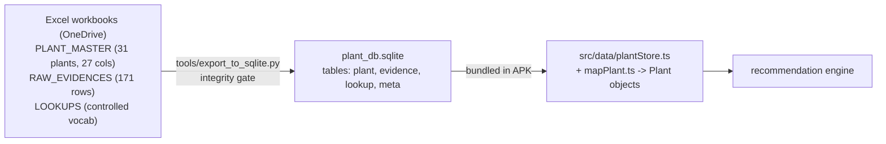

# Lumen — Master Brief for Thesis Chapter 3 (Research Methodology)

> **To: Claude (chat).** This is a **consolidated, single-source-of-truth** briefing document.
> It merges four prior artifacts that were produced by *two different Claude Code sessions*
> working on the same project (one on application features/UX, one on the evidence dataset),
> plus this session's own implementation round, into one document so you do not have to
> reconcile them yourself or risk citing a stale number. Read this document fully before
> drafting Chapter 3. Where it points at a source file, ask the author to paste it if you
> need exact wording — everything you need to write Ch3 at a high standard is here.
>
> **Provenance of what was merged:**
> 1. `THESIS_HANDOFF.md` — architecture + full Ch1/Ch3 methodology brief (earlier round).
> 2. `IMPLEMENTATION_REPORT.md` — round-by-round implementation log + evaluation evidence
>    (Rounds 1–3 of feature work).
> 3. `THESIS_DLI_MATERIAL.md` — the lux-vs-PPFD/DLI scientific-positioning material and
>    literature-review matrices.
> 4. `SESSION_REPORT_ZZ_PPFD_2026-06-24.docx` — a **separate Claude account's** dataset-integrity
>    session (ZZ Plant PPFD correction, evidence dataset now at 171 rows).
> 5. **This session's own Round 11** — application robustness/UX work (distance-edit
>    invalidation cascade, results-loading staleness fix, AR-unsupported-device handling, GPS
>    retry, exit-confirm) done directly in this conversation, not yet documented anywhere else.
>
> I (Claude Code, this session) read all four documents plus the live repository state —
> the bundled SQLite, `export_to_sqlite.py`, and the test suite — and verified every number
> below against the actual code/database rather than trusting any single document's claim.
> Where the source documents disagreed with each other or with the live system, I flag it
> explicitly in **§8 (Ground-truth reconciliation)** rather than silently picking one.

---

## 0. How to use this document

- **Chapter 3 (Research Methodology)** is the primary target — build it from §2–§7.
- **Chapter 1 (Introduction)** objectives/scope should be rewritten per §1 — do not carry over
  the original FYP-1 proposal's "rule-based vs hybrid/ML" objective; it was never built and
  building it would have been indefensible on a 31-plant evidence dataset.
- **Chapter 4 (Results/Evaluation)** should be built from §6 (evaluation evidence already
  produced and re-runnable) plus the test-case spreadsheet referenced in §9.
- Treat **§8 (ground-truth numbers)** as authoritative over any number quoted elsewhere in this
  document or in any earlier artifact — it was checked directly against the live repository on
  2026-06-24.
- **§10 contains my own remarks and judgement calls**, clearly separated from factual reporting.
  Read them — they tell you where to push back on over-claiming and where the project's real
  strengths are.

---

## 1. What the system is, and the objective reframe (Chapter 1 material)

**Lumen** is a mobile application (React Native front-end + native Android Kotlin/ARCore
modules) that recommends indoor plants for a **specific placement spot inside a room**, not for
a whole room. Existing recommenders (Green Oasis, Doshi's PRES, Jaishree's hybrid, Das's
cosine-similarity system) decide using **static light labels** ("low/medium/bright") or regional
weather. Lumen instead **measures the actual light in lux at the chosen spot**, measures **how
far that spot is from the window** (AR), and estimates **whether and when direct sun can reach
it** (Solar Position Algorithm), matching all three against **evidence-based, plant-specific
light thresholds** with an **explainable rule-based + weighted-scoring engine**.

**The objective changed since the FYP-1 proposal — this is load-bearing for Chapter 1.** The
proposal's Objective (ii) framed the project as *"compare a rule-based technique against a
hybrid (ML) technique."* That hybrid model was **never built**, and building it would have
**contradicted** the project's real contribution: a 31-plant evidence dataset is too small for a
trained model to be defensible, and explainability is a hard requirement the author set from the
start. The objective has been reframed to:

> **"Does measuring the actual conditions at a specific placement spot — illuminance (lux) +
> plant-to-window distance (AR) + potential direct-sun exposure (Solar Position Algorithm) —
> produce more differentiated, spot-specific, and explainable plant recommendations than the
> fixed-label ('low/medium/bright') approach used by existing indoor-plant apps (e.g. Green
> Oasis)?"**

Frame this in Chapter 1 as a **deliberate, defensible scope refinement**, not an apology — see
§10.2 for the exact phrasing to use. Reuse the proposal's background/problem-statement/motivation
verbatim (still valid); only the objectives/scope section needs rewriting. Suggested objectives
and the three research questions that fall out of them:

1. **To design and develop** a mobile system that captures the *measured* light (lux), *measured*
   spot-to-window distance (AR), and *computed* potential direct-sun exposure (SPA) at a specific
   indoor placement spot.
2. **To design an explainable recommendation engine** that matches those measured spot conditions
   against evidence-based, plant-specific light thresholds (with per-plant evidence-confidence
   weighting) and produces a ranked, justified plant list.
3. **To evaluate** whether measuring spot-specific conditions yields more differentiated and
   spot-appropriate recommendations than the fixed-label approach, and to validate the
   measurement instruments (phone-lux vs a reference lux meter; AR distance vs a tape measure).

- **RQ1:** Can a consumer phone measure spot illuminance reliably enough (after calibration) to
  drive plant suitability decisions?
- **RQ2:** Does incorporating AR distance and SPA direct-sun materially change the
  recommendation, or is the output secretly driven by lux alone?
- **RQ3:** Does the measured-spot approach differentiate spots that a fixed-label approach
  treats as identical?

RQ2 and RQ3 are **already answered with evidence** — see §6.2–§6.3.

---

## 2. System architecture overview

Four independent capture/computation pipelines feed one scoring engine. The engine and the SPA
are **pure functions** — no React, no I/O, no device dependency — given the same inputs they
always produce the same output. This is why the system is fully unit-tested and why the *same
code* runs on-device and inside the evaluation harness. **Emphasise this in Ch3 as a
methodological strength (reproducibility / differential-testability).**



### Tech stack & repository map

- **Front-end:** React Native — `App.tsx` is the step-wizard shell and all `useMemo` glue that
  wires sensors → engine → UI.
- **Native Android bridge modules (Kotlin):** `ARModule.kt`, `ARPackage.kt`, `CompassModule.kt`,
  `LocationModule.kt`, `EvalLogModule.kt`, `PlantDataModule.kt`, `MainApplication.kt`.
- **AR core:** `ARMeasurementActivity.kt` (~1,500+ lines) — ARCore via the Gorisse Sceneform fork
  1.23.0 (plane detection, raycast/hit-test, anchors).
- **Reference instruments:** UNI-T **UT383** lux meter; **Samsung Galaxy S21+** phone; a tape
  measure.

| Area | Files | What to read it for |
|---|---|---|
| Engine | `src/engine/{config,types,gates,lightFit,scoring,calibration,explain,recommend}.ts` | The whole recommendation algorithm (§4). `config.ts` = every tuning constant. |
| SPA / sun | `src/sun/solar.ts` | Solar position + direct-sun aperture model (§3.5). |
| Sensors | `src/sensor/{lightSensor,plateau,useLightCapture,compass,useCompassCapture,cardinal}.ts` | Lux capture + plateau reduction; compass. |
| Location | `src/location/location.ts` | GPS one-shot + declination. |
| Data | `src/data/{plantStore,mapPlant}.ts` | Loads the bundled SQLite, maps rows → `Plant`. |
| Eval | `src/eval/{evalRow,evalLog}.ts` | The Chapter-4 CSV schema. |
| AR bridge | `src/ar/arMeasurement.ts` | The typed wrapper over the native AR module. |
| UI | `src/components/*`, `src/ui/*` | Step cards + design system (only if writing a UI section). |

---

## 3. Data capture subsystems

### 3.1 Lux capture & plateau reduction

**Files:** `src/sensor/lightSensor.ts`, `src/sensor/plateau.ts`, `src/sensor/useLightCapture.ts`.

Android's `TYPE_LIGHT` is an **on-change** sensor (it only fires when the value changes — silence
means "value held"). Capture flow:
1. Native module streams `TYPE_LIGHT` events to JS; each is timestamped with `Date.now()` on
   arrival.
2. After a 10-second guided capture, `extractPlateauReading(samples, endMs)`:
   - **Hold-last-value resample** onto a uniform 10 Hz grid (`resampleStepMs = 100`).
   - **Plateau segmentation:** a new segment starts when a sample deviates from the running
     segment median by more than `max(10%, 30 lx)` (`relTol = 0.1`, `absTolLux = 30`).
   - Returns the **median of the longest stable plateau** (later plateau wins ties), or `null` if
     no plateau reaches `minPlateauMs = 1000` (the UI then asks for a retry rather than guessing).
   - **Coverage floor (field-driven, added after the initial design):** the live single-capture
     call additionally rejects (`null`) if the longest plateau covers **under `minCoverage = 0.35`
     (35%)** of the whole 10 s capture. This has **no offline-tool equivalent** — it was added
     specifically because manual device testing found the original "any ≥1 s calm stretch
     anywhere" rule let a brief calm moment salvage a "Fair" reading even when most of the 10 s
     was deliberately disrupted (real field cases: 30% and 14% coverage both still passed under
     the old rule). This is a good example of a methodology decision **driven by empirical
     on-device testing**, not a-priori design — cite it that way in Ch3.
3. The returned lux is **RAW** (uncalibrated) and carries quality metadata (`good`/`fair`,
   plateau ms, coverage, spread %).

**Methodological strength to highlight:** the *same* plateau criterion is used offline in
`tools/extract_phone_readings.py`, so Chapter 3 can describe **one** segmentation criterion for
both the runtime app and the offline field-dataset extraction.

### 3.2 Lux calibration ("both" mode)

**File:** `src/engine/calibration.ts`, constants in `src/engine/config.ts`.

The phone sensor under-reads. A linear regression over **210 paired field readings** (Samsung
S21+ vs UNI-T UT383, Apr–May 2026; 70 sessions × 3 distances [50/100/150 cm]) gives:

```
calibrated_lux = 1.1054 × phone_lux + 134.4          (Pearson r = 0.996, R² = 0.993)
```

- **"Both" mode:** `SpotInput.lux` stays RAW; the engine applies calibration at scoring time;
  every `Recommendation` carries both `luxRaw` and `luxUsed`.
- **Range guard:** below `validMinLux = 200 lx`, the large intercept over-predicts wildly (a real
  15 lx reading would become 151 lx), so the **raw value is returned unchanged** below 200 lx.
  Validated range is 200–6000 lx.
- These constants are regenerated **only** by `tools/analyze_spot_observations.py` — never
  hand-tuned. State this in Ch3; it is a credibility point.
- **Report the held-out number, not just R², in Chapter 4.** R² = 0.993 is the in-sample fit on
  the same 210 pairs used to build the line. A session-level 5-fold cross-validation gives the
  honest accuracy: **MAE ≈ 268 lx / MAPE ≈ 15%** in the valid range (≥200 lx). (A naive all-rows
  MAPE of ~38% is inflated by sub-200-lx dimness — exactly why the range guard exists. State
  both numbers and explain why they differ.)

### 3.3 AR distance & window measurement

**Files:** `ARMeasurementActivity.kt`, `ARModule.kt`, `src/ar/arMeasurement.ts`.

- Floor-to-floor protocol: the plant marker and window marker are both snapped to a
  `HORIZONTAL_UPWARD_FACING` plane (the floor), not to arbitrary surfaces.
- **Two distance values are computed per measurement, and they answer different questions:**
  - **`distanceMeters`/`distanceCm` (straight-line, 3D):** the full Euclidean distance between
    the two anchors — `sqrt(dx² + dy² + dz²)`, including the vertical (Y/gravity) component.
  - **`horizontalDistanceMeters`/`horizontalDistanceCm` (floor-plane):** excludes the vertical
    component — `sqrt(dx² + dz²)`. This is the value the engine and the tape-measure validation
    protocol actually use, because a tape measure run along the floor measures the horizontal
    distance, not the 3D straight line. Since both anchors are floor snaps, the two values should
    be nearly identical in principle; small real-world differences come from sub-centimetre
    AR floor-tracking noise (the two floor hit-points are rarely at *exactly* the same height).
    **This is worth one sentence in Ch3's AR-methodology section** as it explains a question the
    author was asked during testing ("why do the two numbers differ slightly?").
- AR hit-quality has **four** values — `PLANE / DEPTH / FEATURE_POINT / INSTANT_PLACEMENT` — plus
  an `UNKNOWN` fallback, and a plane hit is downgraded to `DEPTH` on plane-mismatch (the two
  measurement points locked onto different detected planes). Not a simple three-tier scale —
  if Chapter 3 or 4 describes AR confidence, use these four values precisely.
- **Manual tape fallback:** AR distance is **mandatory** in the UI (the wizard cannot proceed
  without it), but a manual cm entry is the alternative way to satisfy that requirement when
  ARCore can't track. Exactly one source is active at a time (`effectiveDistanceM`); the eval log
  records `plant_distance_source` (`ar`/`manual`) so AR-accuracy statistics stay uncontaminated
  by manual rows.
- **Window size (width/height/sill) is explicitly prototype-only/approximate** — distance is the
  reliable AR output; window size validation against tape is reported honestly as a secondary,
  less-reliable measurement (white walls, plain window frames, and reflective glass give ARCore
  few feature points on vertical surfaces).
- **AR-unsupported devices (field-confirmed, see §7.4):** on a device ARCore genuinely cannot
  support (verified on a Xiaomi Redmi Note 10), the system now detects this *before* attaching
  the AR camera fragment and shows an explicit dialog plus the manual-tape fallback, instead of a
  blank black screen. This is a robustness fix, not a measurement-methodology change, but it is
  worth one sentence in Ch3/Ch5's limitations section: AR distance capture has a hardware
  dependency that the system now handles gracefully rather than silently failing.

### 3.4 Compass + GPS → true azimuth

**Files:** `CompassModule.kt`, `src/sensor/{compass,useCompassCapture,cardinal}.ts`,
`LocationModule.kt`, `src/location/location.ts`.

- Circular-mean heading sampling; the window-facing aspect is the **only optional** wizard step.
- **Tilt, not magnetic interference, is the field-confirmed cause of a wrong heading.**
  `getOrientation()`'s azimuth is only stable when the phone is flat; tilting it up to read the
  number (a natural human instinct) destabilises it. A magnet pressed to the phone could not
  reproduce an originally-observed heading flip, disproving an earlier hard-iron-interference
  theory. `CompassModule.kt` emits `tiltDeg` (from the rotation matrix's device-Z-vs-world-up
  angle, not pitch/roll, which share the same instability); the UI warns past 30°
  (`isTiltedTooFar`). Accuracy (worse-of rotation-vector + raw magnetic-field) is kept only as a
  secondary signal, since Android's accuracy callback is independently documented to be
  throttled/hardcoded on some OEMs. **This is a good real-world-methodology anecdote for Ch3**:
  an initial theory (hard-iron interference) was tested and disproven by direct experimentation,
  and replaced with the correct, evidence-backed explanation (tilt instability).
- GPS one-shot (coarse) converts the compass's magnetic azimuth to true north via
  `GeomagneticField` declination; falls back to magnetic azimuth if no GPS fix (declination is
  far below the 90° aspect-sector width nearly everywhere, so the fallback rarely changes the
  result). **Granting the location permission does not guarantee the GPS fix itself succeeds**
  (common indoors) — see §7.3 for the retry mechanism added this session.

### 3.5 Solar Position Algorithm & the direct-sun aperture model

**File:** `src/sun/solar.ts` (pure TypeScript, unit-tested against ephemeris values).

- **Solar position:** `solarPosition(epochMs, latDeg, lonDeg)` implements the **NOAA General
  Solar Position Calculations** (Meeus-based), returning `{azimuthDeg, elevationDeg,
  declinationDeg, equationOfTimeMin}` to ~±0.01°. **Cite Reda & Andreas (2004)** as the reference
  SPA, and justify the lighter formulation by an accuracy-requirements argument: 0.01° is ~3
  orders of magnitude finer than the 90° window-aspect sectors and the ~5–10° error of a phone
  compass, so the full NREL coefficient tables would add no *usable* precision.
- **What the SPA answers:** it does **not** predict lux. It answers *"could direct sun reach this
  window/spot, and when?"* Output is always labelled **POTENTIAL** direct sun (clear,
  unobstructed-sky assumption; real obstructions only reduce it).
- **Two models:**
  - `estimateDirectSun(date, lat, lon, windowAzimuth)` — orientation-only fallback: at each 5-min
    sample, the sun "counts" if elevation ≥ `minElevationDeg` (3°) and its azimuth is within
    `maxIncidenceDeg` (85°) of the window's facing. This is the model used whenever AR window
    dimensions are not available — it only needs the compass facing, **not** window size, which
    is why a user can skip window measurement and still see a sun-hours estimate (it is the
    cruder of the two models, and the UI labels it differently — see §7.2's note on this).
  - `estimateDirectSunThroughAperture(date, lat, lon, windowAzimuth, aperture)` — the
    **spot-specific** model and the **only place AR window dimensions enter any computation**.
    Inputs: `widthM`, `sillM`, `topM (= sill + height)`, `distanceM`, and a signed
    `lateralOffsetM` (where the plant sits along the window width; default 0 = centre). Two
    tests per 5-min sample:
    1. **Azimuth cone** — the sun's *signed* azimuth deviation from the window normal must fall
       between the window's two edges *as seen from the (possibly off-centre) plant*:
       `atan((−W/2 − x)/d) − margin ≤ dev ≤ atan((+W/2 − x)/d) + margin`, where `x =
       lateralOffsetM`, `d = distance`, margin = `azMarginDeg` (6°). At `x = 0` this reduces to
       the symmetric `±(atan(W/2/d) + margin)` cone. **A plant at the window's edge can only be
       reached by sun coming from the opposite side** — this is why the rendered Top-view cone
       visibly leans/skews for an off-centre plant; it is correct geometry, not a rendering bug
       (this was independently verified twice in this session against the live formula).
    2. **Vertical penetration band** — the sun-beam height at the plant, `[sillM − d·tan(α), topM
       − d·tan(α)]` (α = elevation), must overlap the plant's `[0, assumedPlantTopM ±
       vertMarginM]` extent (plant-top 0.4 m, margin 0.1 m).
    Passing samples cluster into `SunInterval{startMin,endMin}`, summed into `hours`.
  - `daylightWindow(date, lat, lon)` — first/last minute the sun is above the floor; used to draw
    the sun's full path even when 0 h reach the spot, so the user sees *where* the sun goes even
    when it misses the window.
- **Constants to defend in Ch3:** `DIRECT_SUN_PARAMS = { minElevationDeg: 3, maxIncidenceDeg: 85,
  sampleStepMin: 5 }`; `APERTURE_PARAMS = { azMarginDeg: 6, vertMarginM: 0.1, assumedPlantTopM:
  0.4 }`.
- **Lateral-offset honesty note:** lateral plant position is a **geometric refinement justified by
  trigonometry + unit tests, not by field-measured lux.** Frame it as improving the *geometric
  fidelity* of the *potential* estimate — never as field-validated accuracy.
- **Citations for the aperture margins:** Szerman et al. (2014) and LBNL daylighting rules.
- **Night/civil-twilight handling is a deliberately separate constant** from the SPA's beam-floor:
  `NIGHT_THRESHOLD_ELEVATION_DEG = -6°` (civil twilight — "is the sky still giving off ambient
  light") is distinct from `DIRECT_SUN_PARAMS.minElevationDeg = 3°` (a sun-beam physics floor —
  "can a direct beam usefully reach a window"). Conflating the two would flag a still-bright
  early evening as "night" the instant the sun dips below the horizon. A post-capture disclaimer
  warns the user when a reading was taken at night that it may be artificial light, not daylight
  — and **as of this session, that same warning is now also surfaced directly on the
  recommendation list itself**, not only on the separate sun-estimate card (see §7.2).

---

## 4. The recommendation engine — full algorithmic flow

**Files:** `src/engine/` — `recommend.ts` orchestrates; constants in `config.ts`.

`recommend(plants, spot)` is a **pure function**. Pipeline per plant:



### 4.1 Gates (`gates.ts`) — policy = "lux floor + direct-sun only"

Only two hard eliminations exist:
- **Gate 1 — survival floor:** `spot.lux < plant.maintenance_lux_min` (using the **calibrated**
  lux, not the raw reading — if quoting an elimination-reason string verbatim, use the exact
  wording in the live test-case sheet).
- **Gate 2 — scorch:** `plant.direct_sun_tolerance === 'none'` AND `spotHasDirectSun(spot)` →
  eliminate. `spotHasDirectSun` = `directSunPresent === true` OR `directSunHours ≥
  DIRECT_SUN_HOURS_THRESHOLD (1.0)`.
- **Window orientation is deliberately NOT a gate** — only a scoring/explanation factor (it feeds
  the SPA sun estimate, an upstream variable, but is never a gate or score term itself). Gating
  on it would contradict the thesis spine (measured spot lux beats static labels). **This is a
  key methodological decision to defend in Ch3.**

### 4.2 The four weighted factors (`scoring.ts`) — `WEIGHTS = light .30 / directSun .25 / distance .25 / confidence .20`

1. **Light fit** (`lightFit.ts`): piecewise [0,1] — `lux < maintenance_lux_min` → 0 (also gated);
   `lux > preferred_lux_max` → 0.7 (bright excess; possible stress); `lux ≥ preferred floor` →
   1.0; between floor and preferred → ramps `0.6 + 0.4·((lux−floor)/(good−floor))`.
   `preferredFloor = preferred_lux_min ?? maintenance_lux_max ?? preferred_lux_max` (handles the
   sparse-threshold reality of the dataset honestly).
2. **Direct-sun comfort** (`directSunFactor`): from `direct_sun_tolerance` × SPA hours.
   `tolerant` → 1.0 always; `some` → 1.0 if no sun or hours ≤ `SOME_TOLERANCE_HOURS_OK (3.0)`,
   else 0.6; `none` → 1.0 if no direct sun, else 0.2 (Gate 2 usually eliminates first); `unknown`
   → 0.6 (cautious neutral). If no sun data captured → `available: false` (dropped, weights
   renormalised).
3. **Distance fit** (`distanceFactor`): AR distance → zone, crossed with the plant's light class
   via `ZONE_CLASS_FIT`:

   | zone \ class | high | medium | low |
   |---|---|---|---|
   | **near** (≤1.0 m) | 1.0 | 0.7 | 0.4 |
   | **mid** (≤2.5 m) | 0.7 | 1.0 | 0.7 |
   | **deep** (>2.5 m) | 0.4 | 0.7 | 1.0 |

   Light class by `maintenance_lux_min`: low ≤ 800, medium ≤ 5000, else high. Idea: high-light
   plants belong near the window; low-light plants prefer to be set back.
4. **Evidence confidence** (`confidenceFactor`): `CONFIDENCE_SCORE` = high 1.0 / medium 0.7 / low
   0.45 / provisional 0.3. Propagates dataset uncertainty into the score so a shaky-evidence
   plant can never out-rank a solid one on a tie.

### 4.3 Weighted sum + renormalisation

```
score = ( Σ available factors: weight·value ) / ( Σ available weights ) × 100
```
If an optional input (SPA, AR distance) is missing, that factor's weight is dropped and the
**remaining weights are renormalised**, so partial captures score honestly; the result is flagged
`recommendationConfidence = 'reduced'`. (Note: AR distance is mandatory in the UI — only the
*sun* input can genuinely be missing in practice, since a manual-tape fallback satisfies
distance. The missing-distance renormalisation path therefore exists correctly in code but is
exercised only by unit tests, not reachable through the live UI — state this precisely if Ch3
discusses it.)

### 4.4 Ranking & explanation

- Sort survivors by **score desc → confidence rank → common name**.
- `explain.ts` builds a plain-language **"why"** per plant from the four factors plus a
  `displayWarning` (sun risk / low-confidence / proxy-evidence note). **Every recommendation is
  explainable — this is non-negotiable and is the project's defensibility spine.**
- As of this session, the recommendation list also surfaces an **expandable per-plant score
  breakdown** ("See score breakdown") showing all four weighted factors as coloured bars with
  their real sub-score and a plain-language note — useful both as a Ch3 illustration figure and
  as the basis for any "is the score box transparent enough?" examiner question.

---

## 5. Dataset construction & integrity pipeline

### 5.1 Pipeline overview

The evidence-based plant dataset is the project's **data contribution**, authored in Excel
(OneDrive, **not** the repo) and exported to a bundled SQLite.



- **Per plant:** `maintenance_lux_min/max` (survival range), `preferred_lux_min/max`
  (ideal/ornamental range), `direct_sun_tolerance` (none/some/tolerant/unknown),
  `final_confidence` (high/medium/low/provisional), `aspect_orientation` (N;E;S;W), plus optional
  PPFD/DLI scientific-enrichment fields (see §5.4).
- **Two threshold levels per plant** (maintenance vs preferred) is an intentional decision — the
  engine distinguishes "stays alive" from "thrives," and this is independently grounded in the
  DLI literature (§5.4).
- **Integrity gate:** `export_to_sqlite.py` aborts the build on any violation (row counts, orphan
  FKs, missing evidence refs, LOOKUP-code compliance, empty source URLs). Every value traces to a
  URL-accessible source. **Stress this in Ch3** — it is the project's single strongest
  data-credibility claim.
- **Field light dataset (calibration source):** 210 paired observations = 70 sessions × 3
  distances (50/100/150 cm); Pearson r = 0.996; fit `1.1054·x + 134.4` (R² = 0.9928). Manual
  `SPOT_OBSERVATIONS` readings are final; plateau re-extraction is an independent QA cross-check
  only and never overwrites master data.

### 5.2 Dataset-integrity case study: the ZZ Plant PPFD correction (2026-06-24)

This is a concrete, recent worked example of the integrity pipeline catching and correcting a
real dataset error — **good primary material for Ch3's "dataset validation procedure"
subsection**, since it demonstrates the procedure in action rather than only describing it.

**Trigger.** ZZ Plant (*Zamioculcas zamiifolia*) carried a `preferred_ppfd` of **200–400
µmol·m⁻²·s⁻¹** in PLANT_MASTER, which sat oddly beside its stored DLI of **1–10
mol·m⁻²·day⁻¹** for a documented low-light species.

**Validation procedure applied (three independent checks):**
1. **Traceability check.** The 200–400 value originated from three evidence rows (E0024, E0063,
   E0131), all **Grade C aggregators** (Photone / Plant Light Database), all marked
   `support_only`. Fetching the aggregators' own cited primary sources (House Plant Journal,
   UF/IFAS) showed neither supports 200–400: House Plant Journal gives **20–40
   µmol·m⁻²·s⁻¹**; UF/IFAS EP252 gives **25 fc (≈5 µmol·m⁻²·s⁻¹)** as the maintenance minimum.
2. **Internal-consistency check.** At PPFD 200–400, a DLI of 1–10 mol·m⁻²·day⁻¹ would require only
   ~3–7 h of light/day. At a realistic 10–12 h indoor photoperiod, PPFD 200 already yields DLI ≈
   7–9 and PPFD 400 yields DLI ≈ 14–17 — **above** the stated ceiling of 10. The two numbers
   stored for the same plant contradicted each other.
3. **Plausibility check.** The 200–400 range matches grow-light production-greenhouse figures,
   not interior-maintenance light for a shade-tolerant aroid.

**Verdict:** the 200–400 value was not defensible and was replaced with traceable evidence.

| Source | Grade | ZZ PPFD reported | Role in decision |
|---|---|---|---|
| UF/IFAS EP252 | A | 25 fc (~5 µmol·m⁻²·s⁻¹) | Maintenance backbone (existing evidence row); confirms low-light survival |
| House Plant Journal | B | 20 / 40 µmol·m⁻²·s⁻¹ | **New** primary-quality source (100 FC = 20 min; 200 FC = 40 good growth; calibrated light meter, per-species) |
| HomePlantBot | C | 75–150 µmol·m⁻²·s⁻¹ | **New** support-only source corroborating the upper bound |
| Photone / Plant Light DB | C | 200–400 µmol·m⁻²·s⁻¹ | **Superseded** — aggregator, untraceable to a primary source, DLI-inconsistent. Notes flagged in the workbook, rows **not deleted** (audit trail preserved) |

**Corrected PLANT_MASTER values for ZZ_PLANT:**

| Field | Before | After |
|---|---|---|
| `maintenance_ppfd_min` | (empty) | 20 |
| `preferred_ppfd_min` | 200 | 40 |
| `preferred_ppfd_max` | 400 | 150 |
| `dli_min` / `dli_max` | 1 / 10 | 1 / 10 (unchanged — **now** consistent with the new PPFD range) |
| `supporting_evidence_ids` | …E0161 | …E0161;E0169;E0170;E0171 |

Three new evidence rows were added (E0169, E0170, E0171) and the three superseded rows received a
dated `PPFD_FLAG` note rather than deletion — preserving the audit trail per the project's
integrity rule that evidence is never silently removed.

**Cross-check of every PPFD-bearing plant.** Every plant in PLANT_MASTER carrying any PPFD value
was audited against its `used_in_final_threshold = yes` evidence rows. ZZ Plant was the **only**
genuine mismatch; PEARLS_AND_JADE, PHILODENDRON_HEDERACEUM, and STAR_BRIGHT were all confirmed as
exact matches to their cited evidence.

**Remaining open item — `FICUS_GROUP` (flagged, not auto-fixed; see §9).** `FICUS_GROUP` stores
`preferred_ppfd = 80–160`, sourced only from Grade C aggregators (no `used=yes` PPFD row behind
it) and mildly DLI-inconsistent. It was **not changed**, because it is at least loosely
corroborated by Shagol et al.'s measured leaf light-compensation points (44–105 µmol). A dated
note was appended recommending verification against a Grade A/B Ficus-specific source before
final Chapter 4 submission. **This is a legitimate item for the author to resolve, and a good
example for Ch3 of the dataset's stated confidence/flagging policy in action** ("evidence has a
confidence value; absence of strong evidence is flagged, not silently treated as fact").

### 5.3 Pipeline re-run after the correction

`tools/export_to_sqlite.py`'s `EXPECTED_EVIDENCE` constant was updated to match the corrected
evidence-row count, the SQLite was rebuilt, and the integrity gate passed cleanly (row counts,
orphan FKs, missing refs, LOOKUP codes, empty URLs all clean). **The live database was checked
directly for this brief** and is the ground truth quoted in §8 — use those numbers, not any
earlier draft number from an individual session report (a minor arithmetic inconsistency exists
in the dataset-session's own narrative about exactly how many rows were net-added; the **end
state is independently verified correct** against the live file, so it does not affect anything
downstream).

### 5.4 DLI/PPFD as scientific enrichment — never measured, never scored

This positioning is central to defending the "why lux, not PPFD" design choice in Ch2→Ch3.

> Although Photosynthetic Photon Flux Density (PPFD) and the Daily Light Integral (DLI) are more
> biologically representative of plant photosynthesis, lux remains the most practical measurement
> unit for consumer-grade indoor assessment because smartphone ambient-light sensors and
> affordable lux meters measure illuminance directly. Sugano et al. show that the same 1000 lux
> corresponds to different PPFD by light source (18.0 µmol·m⁻²·s⁻¹ for CIE D65 daylight, 14.5 for
> white LED, 16.2 for fluorescent), so a single lux→PPFD conversion is not physically valid.
> Therefore this study uses measured illuminance (lux) as the runtime comparison unit while
> integrating PPFD and DLI evidence where available to improve scientific interpretability. The
> system never claims lux = PPFD.

Talking points for the viva:
- The phone `TYPE_LIGHT` sensor is an illuminance sensor; PPFD needs spectral/PAR information.
- DLI = PAR integrated over a whole day; the app captures one steady spot reading plus an SPA
  *potential direct-sun-hours* estimate — neither is a measured DLI. Scoring on DLI would require
  fabricating a spot PPFD/DLI, which the integrity rule forbids.
- The system's layers are already separated: runtime = lux; enrichment = PPFD/DLI; SPA =
  sunlight direction/time, not PPFD prediction.

**DLI justifies the maintenance-vs-preferred split** (§4 of the engine): Heród & Malik (2022)
found raising DLI from 0.1–0.3 to 1.1–1.7 mol·m⁻²·day⁻¹ improved diameter, height, leaf
length/width/area, dry weight, and carotenoid content in indoor vertical-garden plants
(Asplenium, Chlorophytum, Philodendron) — *a spot can be adequate for maintenance yet not for
preferred growth/ornamental quality.* Sugano et al. (2024) found three aroid species sustained 191
days at 6.8 µmol·m⁻²·s⁻¹/9 h, but more light/longer photoperiod improved relative growth rate
while changing form — *survival ≠ thriving.*

**External-validation cross-check** (containment/overlap, not exact equality, since the stored
DLI ranges are deliberately wide evidence *envelopes*):

| Plant | Our DLI (mol·m⁻²·day⁻¹) | Published reference | Verdict |
|---|---|---|---|
| ZZ Plant | 1–10 | Kheybari & Kasravi: ZZ 2–5 | Contains published range |
| Corn Plant / Fragrant Dracaena | 4–14 | Kheybari: Dragon Tree 10–18 | Overlaps upper half (different cultivar) |
| African Violet | 8–15 | Hort. refs ~6–12 for flowering | Overlaps, slightly higher top |
| Boston Fern | 2–6 | Low-light fern ranges ~1–6 | Consistent (lowest-light plant in set) |
| Snake Plant | 1–14 | Tolerant species; wide published spread | Wide-tolerance consistent |

**Coverage statistic for Ch4:** 25/31 plants (81%) carry a DLI range; 6 rely on lux + other
evidence only. State this honestly as supporting the "evidence has confidence; absence ≠ fact"
stance, rather than implying full coverage.

**Lux-class ↔ UDI consistency (free external validation):** the engine's `LIGHT_CLASS` boundaries
align with the published Useful-Daylight-Illuminance plant groups (Szczepańska-Rosiak et al.):

| Engine `LIGHT_CLASS` (by `maintenance_lux_min`) | UDI plant group |
|---|---|
| low ≤ 800 lx | low-light: 800–2000 lx |
| medium ≤ 5000 lx | medium-light: 2000–5000 lx |
| high > 5000 lx | high-light: >5000 (5000–11000) lx |

**In-app implementation (already built):** the 25 DLI-bearing plants surface their DLI /
photoperiod / PPFD on the recommendation card in a separate, plain-language **"Light science
(reference)"** panel, explicitly labelled *not measured, not used to rank*. A test asserts
`score`/`factors` are byte-identical with and without this reference data present — i.e., the
enrichment layer is provably inert with respect to scoring. **This is an excellent Ch3 sentence:**
*"To guarantee the scientific-enrichment panel could never silently influence the ranking, a unit
test asserts the computed score and factor breakdown are identical whether or not DLI/PPFD
reference data exists for a plant."*

**Literature-review matrix (Ch2):**

| Paper | Light metric | Environment/method | Key finding | Use in thesis |
|---|---|---|---|---|
| Tan et al. 2017 | DLI/LCP | Singapore indoor greenery case study | Generic 1000-lux rule over/under-compensates; onsite survey needed | Core gap: lux-label assessment insufficient |
| Sugano et al. 2021 | PPFD/spectral | ALFA/Radiance simulation | Same lux → different PPFD by source | Justifies "never lux = PPFD" |
| Sugano et al. 2024 | PPFD/DLI | Growth chamber, low-light species | Sustains some species at 6.8 µmol; more light changes form | Survival vs preferred; appearance |
| Kheybari & Kasravi 2022 | DLI | Radiance + TRNSYS, shading | Location + species DLI target drive placement | Supports spot/orientation logic + DLI table |
| Heród & Malik 2022 | DLI | Indoor vertical-garden experiment | Higher DLI improves ornamental quality | Justifies maintenance-vs-preferred split |
| Szczepańska-Rosiak et al. 2025 | UDI (lux) | Annual daylight simulation, N/E/S/W, 5 climates | Suitability is spot/orientation-dependent | Validates lux bands + spot-not-room principle |
| Shagol et al. 2018 | PAR Km (ETR) | PAM fluorometer, 93 indoor species | Wide light-requirement range across species | Supports species-specific thresholds |

**Existing-systems comparison (novelty/gap):**

| System | Light input | Spatial input | Explainable? | Gap vs ours |
|---|---|---|---|---|
| Green Oasis | Static light label | None | Limited | No measured spot light |
| Doshi PRES | Regional/weather | None | Rule-based | Not spot-specific |
| Jaishree hybrid | Static categories | None | Partial | No on-site measurement |
| Das cosine-similarity | Feature vector | None | Low (similarity score) | No measured lux; opaque |
| **Lumen** | **Measured spot lux (phone, UT383-calibrated)** | **AR distance + window aspect + SPA** | **Yes — per-pick reason** | — |

---

## 6. Evaluation methodology & evidence already produced

This is the part where the objective change becomes an advantage: the system already includes an
**IV/DV evaluation harness** that runs the *real engine* on the *real 31-plant database*. Base
Chapter 4 on its outputs.

**Files:** `tools/eval/ivdv_evaluation.test.ts`, `tools/eval/engine_correctness.test.ts`,
`tools/eval/output/{variables,part1_verification,part2_comparison,engine_correctness}.md`,
`tools/analysis_output/{agreement_summary,distance_falloff,within_spot_spread,
calibration_crossval}.csv` + `calibration_constants.txt`.

### 6.1 Variables (operationalised — put this table in Chapter 3 and/or 4)

- **Independent variables:** IV1 = measured spot lux; IV2 = AR plant-to-window distance; IV3 =
  SPA potential direct-sun (hours/presence). Window aspect + window geometry are **upstream** IVs
  (they feed IV3, not the score directly).
- **Dependent variables:** recommended set, ranking, 0–100 suitability score, gate outcome,
  recommendation confidence.

### 6.2 Part 1 — proof the engine genuinely uses distance & sun (answers RQ2)

Holding lux **constant at 3000 lx** and varying only distance + sun produced **8 → 30 → 8**
recommendations across three spots (near+sun / deep+no-sun / mid+some-sun). A lux-only system
would have returned the same list all three times. It did not → distance and sun are
**load-bearing**, not decorative.

### 6.3 Part 2 — measured-spot vs fixed-label baseline (answers RQ3)

An isolated `scoreLabelGuessed(lux)` baseline mirrors fixed-label apps (Photone global bands: low
1–4,000 / medium 4,000–11,000 / full 11,000–32,000 lx; lux only; unranked). Run on the real field
triplets:
- **The sun axis is the unbreakable argument:** lux cannot encode *direct* sun, so two 2000 lx
  spots (north shade vs west window with 3 h sun) get the *same* label list but the engine drops
  scorch-prone plants from the sunny one.
- **The distance axis:** lux falls off with distance (median to ~34% from 50→150 cm), but stays
  inside **one** Photone band ~55% of the time. In those 55% the fixed-label method is **blind**;
  the measured engine still differentiates in **89%** of them (median 11 of 31 plants differ).
  Across all sessions the engine differentiates in ~49% that the label method cannot.

**Honest framing (use this):** the *sun* axis alone justifies the measured approach; *distance*
adds scoring value but is partially redundant with lux. Say both.

### 6.4 Internal-validity verification (engine correctness)

**620/620 (100%)** plant-spot gate+band decisions match an independent re-derivation of the
verdict from the dataset's own cited thresholds (differential testing against a second,
independent implementation of the same rules). This proves "the engine faithfully applies its
own evidence base" — it does **not** claim the thresholds themselves match horticultural reality
(that would be external validity, the one remaining gap, see §6.6).

### 6.5 Instrument validation

- **Phone-lux vs UT383:** r = 0.996, R² = 0.993 in-sample; **MAE ≈ 268 lx / MAPE ≈ 15%**
  cross-validated held-out (the number to actually report in Ch4 — see §3.2).
- **AR distance vs tape:** the eval CSV carries explicit tape-reference fields
  (`ref_tape_distance/width/height/sill_cm`) plus 5 UT383 lux fields + a computed median, mirroring
  the original 5-reading field protocol — one saved row validates all four AR-fallible dimensions
  at once. `Functional_Test_Case_Log_v2.xlsx` / `AR_vs_Tape_Validation_Log_v2.xlsx` /
  `Window_Size_AR_vs_Tape_Log.xlsx` hold the manual test-case and validation templates.
- The eval CSV also logs `plant_lateral_offset_m`, `capture_sun_elevation_deg` (filters
  night/dusk rows), and a tapped `sky_condition` — context only, never an engine input.

### 6.6 Validity framing — three honest pillars (say it exactly like this in Ch4)

1. **Internal validity (verification) — DONE.** 620/620 gate+band decisions match an independent
   re-derivation (§6.4). The engine does its own job correctly; this does not claim the
   thresholds match reality.
2. **Differentiation — DONE.** The measured-spot engine produces different, more spot-specific
   recommendations than the fixed-label baseline (§6.2–§6.3).
3. **Instrument accuracy — DONE for lux (cross-validated); templates ready for AR/window-size.**
   Report the cross-validated held-out calibration error, not only the in-sample R².

**External validity** (do the recommendations match real horticulture?) is the *only* gap —
optionally a thin RHS coarse spot-check (qualitative; an independent authority broadly agreeing
with the dataset's light categories). It is a nice-to-have, **not** required, and must be framed
as coarse agreement, never as a controlled trial.

---

## 7. Robustness & UX layer around the measurement pipeline (this session's work, 2026-06-24)

This round of work is **not** new measurement methodology — it is the consistency/robustness
layer that makes the measurement pipeline trustworthy across realistic, messy real-world usage
(re-edits mid-session, sensor failures, unsupported hardware, accidental navigation). It belongs
in Chapter 3's "implementation" subsection and/or Chapter 5's limitations discussion, framed as
**field-testing-driven hardening of the data-capture protocol**, which is itself a methodological
strength: the protocol was iteratively refined against real device behaviour, not just designed
on paper.

### 7.1 Distance-edit invalidation cascade

If the user edits the plant-to-window distance (Step 1) **after** the light reading was already
captured, this is treated as evidence the user is now considering a physically different spot
(not just refining the same one). The system:
- Resets the light capture to idle (forcing a fresh 10 s capture before the wizard can proceed
  again — the existing sequential step-lock mechanism enforces this automatically once the light
  state is cleared).
- Resets the compass capture and the night/daylight pre-capture checklist acknowledgement.
- Shows a single-button prompt ("Re-check the window facing") once the forced light recapture
  completes, navigating the user to the facing step (which remains the one optional step — they
  may re-read the compass or explicitly skip it).
- Triggers the results-recompute loading screen once the user reaches Results again.

**Methodological relevance:** this protects the integrity of a captured "spot session" — without
it, a user could silently combine a *new* distance reading with a *stale* light/compass reading
from a different physical position, producing an internally inconsistent evaluation-log row.

### 7.2 Night/artificial-light caveat now surfaced on the recommendation list itself

Previously the night-capture disclaimer ("this reading may be artificial light, not daylight")
only appeared on the separate sun-estimate card below the recommendations, not on the
recommendation list itself. As of this session it now also appears as a banner directly on the
recommendation list — the place a user is most likely to actually look. **Decision recorded for
Ch3/Ch5's limitations discussion:** the system does **not** suppress recommendations entirely at
night (which would contradict the project's "measure what's there, flag the caveat honestly"
philosophy applied consistently elsewhere — e.g. reduced confidence, AR-quality flags, the
calibration range guard never refusing a reading outright); instead it shows the result with a
clear, prominently-placed caveat, consistent with how every other source of measurement
uncertainty in the system is handled.

A related, separately-resolved question: skipping window-size measurement still yields a sun-hours
estimate, because the orientation-only SPA fallback (`estimateDirectSun`, §3.5) needs only the
compass facing, not window dimensions — window size only refines that estimate into the
spot-specific aperture model. This is by design, not an inconsistency, and the UI already labels
the two cases differently (a caveat line + a generic schematic diagram for the orientation-only
case, vs the precise aperture diagram for the spot-specific case).

### 7.3 GPS-fix retry

Granting the location permission does **not** guarantee the underlying GPS fix succeeds (common
indoors). The original implementation requested a fix once per session and never retried on
failure, which could permanently strand the user on the magnetic-only compass fallback for the
rest of the session even after granting permission. A "Retry location" control was added (on the
Facing capture card and on the Results sun-estimate prompt), and retrying from Results also
replays the short loading-screen pause while the sun estimate and recommendations recompute.

### 7.4 AR-unsupported device handling (field-confirmed bug, native fix)

Tested live on a device ARCore genuinely does not support (Xiaomi Redmi Note 10): the app
correctly routed the user to the Play Store, which correctly reported the device unsupported —
but returning to the app left a **blank black screen with no message**, because the AR activity
had no handling for the "device permanently incapable" case (only Sceneform's built-in
install/update flow). Fixed natively: `ARMeasurementActivity.kt` now checks
`ArCoreApk.getInstance().checkAvailability()` before attaching the AR camera fragment, and on
`UNSUPPORTED_DEVICE_NOT_CAPABLE` shows an explicit dialog and returns control to the app with a
distinct error code, which the JS layer surfaces as a clear "AR not supported — use the
tape-measurement fields" message instead of a generic "measurement cancelled." This is a genuine
field-testing finding worth one line in Ch5's limitations section: AR distance capture has a
hardware/OS dependency, now handled gracefully rather than failing silently.

### 7.5 Results-loading staleness fix, and exit-confirm + reset-on-Begin

Two smaller consistency fixes, both about not misrepresenting computation state to the user:
- The brief delight-only "calculating" loading screen previously replayed on *every* re-entry to
  the Results screen, even when nothing had changed since it was last shown. It now compares the
  underlying recommendation result by reference (a memoised pure computation) and only replays
  when something genuinely changed — so the system never implies it is "recomputing" when it is
  not.
- Leaving the wizard mid-session (Back button from Step 1 with any progress made) now asks for
  explicit confirmation before discarding captured data, and starting a fresh session from the
  Welcome screen now guarantees a full reset rather than potentially carrying over stale values
  from an abandoned prior session.

These do not change any measurement or scoring logic; they are documented here for completeness
and because Ch3 may want one sentence acknowledging that the implementation went through
iterative robustness hardening informed by hands-on device testing, consistent with the
project's overall empirical, test-driven engineering style.

---

## 8. Ground-truth reconciliation (checked directly against the live repository, 2026-06-24)

Use these numbers. Earlier individual session reports quoted slightly different, now-superseded
figures (e.g. 101 or 105 tests, 168 or 170 evidence rows) reflecting their point in time — they
are not wrong for *when they were written*, but the numbers below supersede them.

| Metric | Verified value | How verified |
|---|---|---|
| Plant rows | 31 | `select count(*) from plant` on the live `plant_db.sqlite` |
| Evidence rows | **171** | `select count(*) from evidence`; matches `EXPECTED_EVIDENCE = 171` in `tools/export_to_sqlite.py` and the database's own `meta` table |
| Lookup rows | 70 | `select count(*) from lookup` |
| DB schema version / generated_at | 1 / 2026-06-24T21:19:47 | `meta` table |
| Jest test suites / tests | **11 suites / 118 tests, all passing** | `npx jest` re-run as part of the final freeze check |
| TypeScript check | Clean | `npx tsc --noEmit` run this session |
| Manual functional test cases | **38** (TC-01…TC-38) | `Functional_Test_Case_Log_v2.xlsx`, updated this session to add TC-35…TC-38 and revise TC-14/20/23/30/34 for the Round-11 work in §7 |

A minor, non-blocking inconsistency: the dataset-correction session's own narrative states
"`EXPECTED_EVIDENCE: 170 → 171` (one net new row: 3 added, 0 deleted)" — arithmetically 170+3
should be 173, not 171. This does not matter for the thesis: the **live database and the live
export-script constant agree exactly at 171**, which is what should be cited. Treat this as a
small reporting slip in that session's own changelog prose, not a data-integrity problem.

---

## 9. Open items (the author's to resolve — none block Chapter 3 writing)

- **`FICUS_GROUP` preferred PPFD (80–160 µmol·m⁻²·s⁻¹)** needs a Grade A/B Ficus-specific source
  before final Chapter 4 submission (§5.2) — currently flagged with a dated note, not changed.
- **External validity spot-check** (optional, qualitative, e.g. a thin RHS coarse agreement
  check) — nice-to-have, not required.
- **Optional fresh-readings calibration sheet** (~25 new pairs) — only if more field data is
  wanted beyond the existing cross-validation.
- **On-device visual verification** of a few UI items (the score-breakdown accordion, the new
  night-warning banner, the AR-unsupported dialog) needs an actual APK build/install — cannot be
  automated from this environment.
- **Source control:** the working tree is currently uncommitted (multiple rounds of work, across
  both Claude sessions). Commit when the author is ready.
- **`THESIS_DLI_MATERIAL.md` §3's integrity flag is now resolved** — if that document is merged
  into the final thesis material, update it to note the ZZ Plant correction (§5.2 above).

---

## 10. Claude Code's remarks and wisdom (synthesis across both sessions, plus my own)

1. **Lead every chapter with the one-sentence thesis:** *"Measure the actual light, distance, and
   sun at the exact spot, and match it to evidence-based plant thresholds with an explainable
   engine — instead of guessing from a vague label."* Everything else in this document supports
   that sentence; if a paragraph you're drafting doesn't trace back to it, cut it.

2. **Turn the objective pivot into a strength, not an apology.** Use: *"On building the system it
   became clear that a trained hybrid/ML model on a 31-plant evidence dataset would be neither
   defensible nor explainable; the objective was therefore refined to evaluate measured-spot vs
   fixed-label recommendation — a comparison that directly tests the project's core hypothesis."*
   This is true, and it is a *stronger* methodological position than the original proposal, not a
   retreat from it.

3. **Never let the prose over-claim.** If you catch yourself writing "the app measures
   sunlight/PPFD/DLI," stop — it **measures lux** and **computes potential** sun. PPFD/DLI are
   enrichment data, proven inert to scoring by a dedicated unit test (§5.4). This is the single
   most common way a Ch3 draft gets rejected by this author — they are unusually strict about it,
   and rightly so, because it is the project's actual scientific honesty.

4. **The two sessions that produced this material had genuinely different jobs, and that is a
   feature, not a mess to apologise for.** One session hardened the *application* (UX
   consistency, sensor-failure handling, native AR robustness) — this is implementation
   engineering. The other hardened the *evidence dataset* (the ZZ Plant correction is a textbook
   example of a validation procedure catching a real error) — this is data curation. Chapter 3
   should present both as **complementary halves of one methodology**: a measurement system is
   only as trustworthy as (a) the instruments and code that capture and score the data, and (b)
   the evidence base those scores are checked against. The ZZ Plant case study in §5.2 is, in my
   judgement, **the single best concrete illustration** in this entire brief of "the dataset
   integrity gate is not decorative" — use it as a worked example, not just an assertion.

5. **Pre-empt the obvious examiner questions** (these are answered, with evidence, in this
   document — just point to the section):
   - *Why lux, not PPFD?* §5.4 — phone-readable, practical; a single lux→PPFD conversion is not
     physically valid (Sugano et al.); PPFD/DLI are out of scope for runtime scoring, stated.
   - *Why rule-based, not ML?* §1 — small, evidence-curated dataset; explainability is a hard
     requirement.
   - *Isn't distance just a proxy for lux?* §6.3 — partly; answered with real data; the sun axis
     is the clean, unambiguous win, distance adds smaller incremental value.
   - *How accurate is the phone sensor?* §3.2/§6.5 — r = 0.996 in-sample; **MAE ≈ 268 lx, MAPE ≈
     15%** cross-validated, within a stated valid range. Always quote the held-out number first.
   - *Isn't AR window-size unreliable?* §3.3 — yes, stated as prototype/approximate by design;
     distance is the reliable AR output and is what the engine actually scores on.
   - *How do you know the engine is implemented correctly, separate from whether the thresholds
     are correct?* §6.4/§6.6 — two genuinely different validity claims, kept explicitly separate
     (internal validity via differential testing vs external validity, which is the one honestly
     unresolved gap).
   - *What happens when a sensor fails or a device lacks hardware?* §7 — handled gracefully and
     field-tested (compass tilt, GPS retry, AR-unsupported devices), not just assumed away.

6. **Ask the author for the FYP-1 proposal and the current thesis draft** before writing Chapter
   1, so the exact background wording and citation style carries over and only the
   objectives/scope section changes.

7. **Use the existing rendered artifacts rather than inventing new diagrams.**
   `tools/report/Lumen_Technical_Report.docx` (deep technical, 10 diagrams) and
   `tools/eval/output/Lumen_Evaluation_Report.docx` (evaluation, 8 diagrams) already exist; ask
   the author to upload both and reuse their diagrams/numbers rather than redrawing.

8. **Methodology must be reproducible on paper.** Describe the algorithms (§3–§4) precisely
   enough that a reader could re-implement them from Chapter 3 text alone — the pseudocode levels
   in this document are about right; expand into full prose + numbered steps, but do not lose
   the exact constants, formulas, or thresholds when you do.

9. **Keep "measured" / "computed" / "assumed" as three deliberately different words throughout
   the thesis.** The app *measures* lux; *computes* POTENTIAL direct sun (clear-sky, geometric);
   and *assumes* an unobstructed sky plus a 0.4 m plant top. Blurring these three words is the
   second most common way a draft gets rejected by this author, after the lux/PPFD conflation in
   point 3.

10. **One thing I would add that neither prior document said explicitly:** the project's overall
    research *style* — design a system, build it for real, then empirically re-test and harden it
    against actual device behaviour (the compass tilt discovery, the plateau coverage floor, the
    ZZ Plant evidence audit, the Redmi Note 10 AR-unsupported case) — is itself worth one
    paragraph in Chapter 3's "Research Design" opening section, framed as an **iterative,
    evidence-driven engineering methodology**, not a linear waterfall. Several of the system's
    most defensible design decisions (the plateau coverage floor, the tilt-not-interference
    finding, the night-threshold decoupling) were *discovered through testing*, not designed
    up-front. That is a legitimate and fairly sophisticated methodological stance for an FYP, and
    it is currently implicit rather than stated — make it explicit early in Chapter 3.

---

## 11. Hard guardrails — do not let the thesis contradict these

- **Lux is the runtime measurement unit.** The app measures **lux**. It does **not** measure
  PPFD/PAR/DLI. PPFD/DLI appear only as scientific framing/enrichment (§5.4) — never claim the
  app measures them, and never claim DLI is used to rank.
- **AR distance is reliable and mandatory; AR window-size is prototype/approximate and optional.**
  Say so plainly whenever AR is discussed.
- **The SPA outputs *potential* direct sun** (clear-sky, unobstructed assumption). Never call it
  "measured" or "actual" sun.
- **No trained ML model exists.** Do not imply one, even in passing.
- **Every recommendation is explainable.** This is the point, not a feature to mention once.
- **Window orientation is an upstream input to the SPA, never an engine gate or score term** —
  keep this distinction precise in any IV/DV table.
- **Dataset values are never hand-tuned.** Every threshold traces to a URL-accessible source or
  is a stated, defended design constant; calibration constants are regenerated only by the
  designated `tools/*.py` scripts.

---

## 12. Files & artifacts checklist for Claude chat to request from the author

- The **FYP-1 proposal** (PDF/DOCX) — for Chapter 1 background reuse.
- The **current thesis draft** (Chapter 2, and any Chapter 1 skeleton).
- `tools/report/Lumen_Technical_Report.docx` + diagrams in `tools/report/img/`.
- `tools/eval/output/Lumen_Evaluation_Report.docx` + diagrams in `tools/eval/docx_build/img/`.
- `tools/eval/output/{variables,part1_verification,part2_comparison,engine_correctness}.md`.
- `Functional_Test_Case_Log_v2.xlsx`, `AR_vs_Tape_Validation_Log_v2.xlsx`,
  `Window_Size_AR_vs_Tape_Log.xlsx` (Chapter 4 manual-testing evidence).
- If exact code wording is needed: `src/engine/config.ts`, `src/engine/scoring.ts`,
  `src/engine/gates.ts`, `src/engine/lightFit.ts`, `src/sun/solar.ts`, `src/sensor/plateau.ts`,
  `src/eval/evalRow.ts`.

---

## 13. References embedded in the system (cite in Ch2/Ch3)

- **Reda, I. & Andreas, A. (2004).** Solar Position Algorithm — the reference SPA.
- **Meeus, J.** *Astronomical Algorithms* — basis of `solarPosition`.
- **NOAA** General Solar Position Calculations — the implemented equations.
- **Szerman et al. (2014)** + **LBNL** daylighting rules — aperture-margin justification.
- **Sugano et al. (2021, 2024)** — lux→PPFD non-equivalence; growth-chamber low-light survival.
- **Heród & Malik (2022)** — DLI and ornamental quality (maintenance-vs-preferred justification).
- **Kheybari & Kasravi (2022)** — DLI simulation, placement/orientation.
- **Szczepańska-Rosiak et al. (2025)** — UDI plant-group lux bands (external validation).
- **Shagol et al. (2018)** — PAR/leaf light-compensation points across 93 indoor species.
- **Tan et al. (2017)** — DLI/LCP indoor greenery case study; motivates the project's core gap.
- **Angel et al. (2025), *Green Oasis*** — the fixed-label baseline the engine is compared
  against.
- **Photone** — the global lux-band convention used for the fixed-label baseline.
- **Zhang (2023)** — supporting evidence used in the dataset (PLANT_MASTER).
- **House Plant Journal, UF/IFAS EP252, HomePlantBot** — the corrected ZZ Plant PPFD evidence
  chain (§5.2).
- Instruments: **UNI-T UT383** lux meter; **Samsung Galaxy S21+**.

---

*End of master brief. Build Chapter 3 from §2–§7, Chapter 1 from §1, and Chapters 4–5 from §6 and
§9–§11. Keep it measured, explainable, and honest — exactly like the system it describes.*
