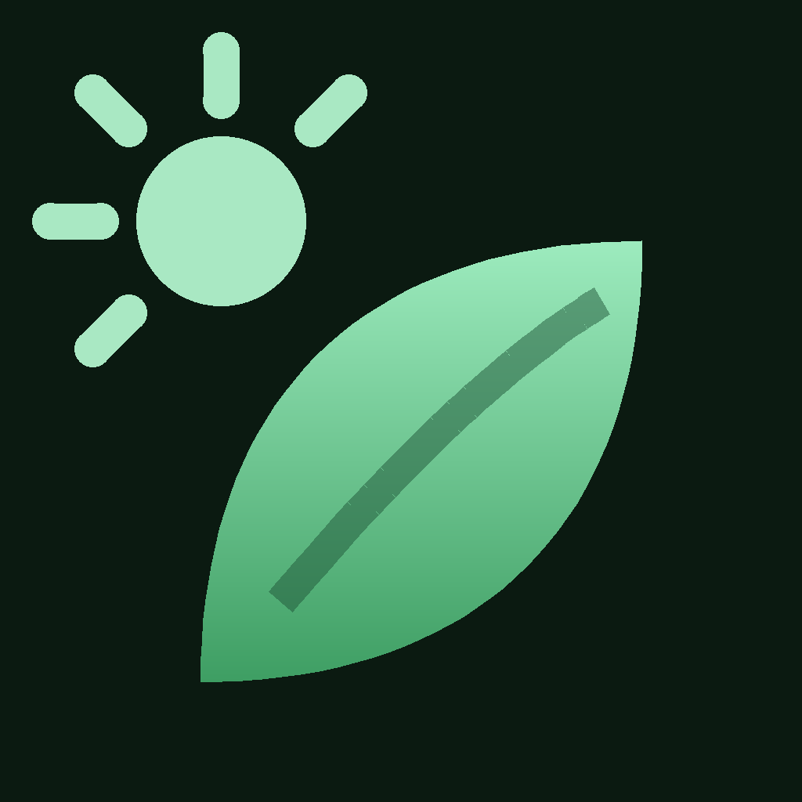
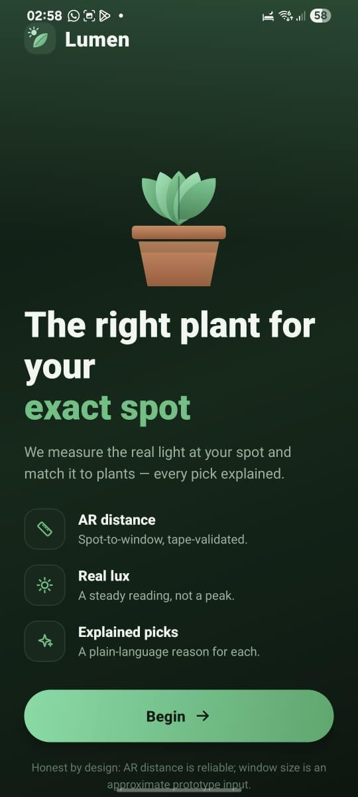
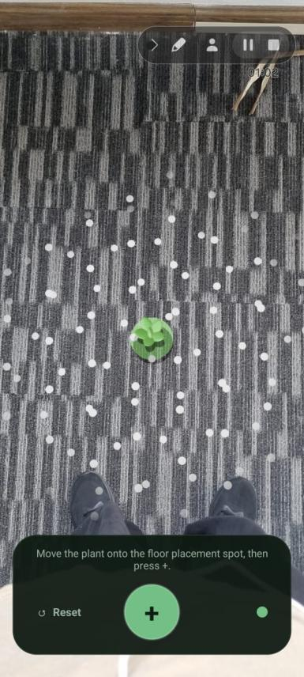
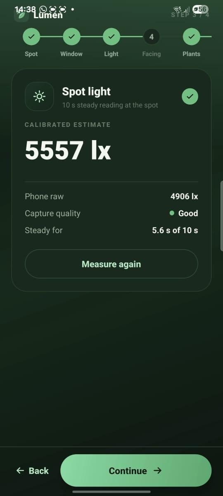
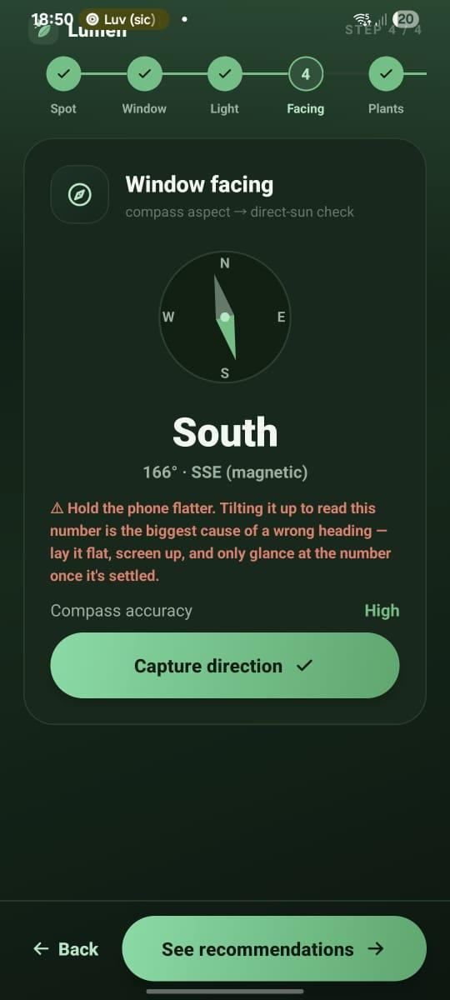
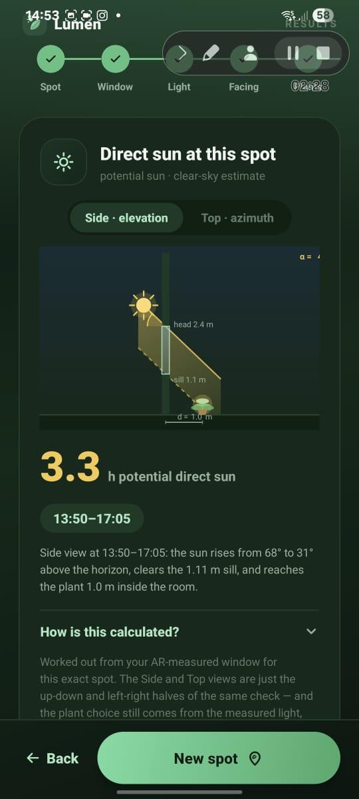
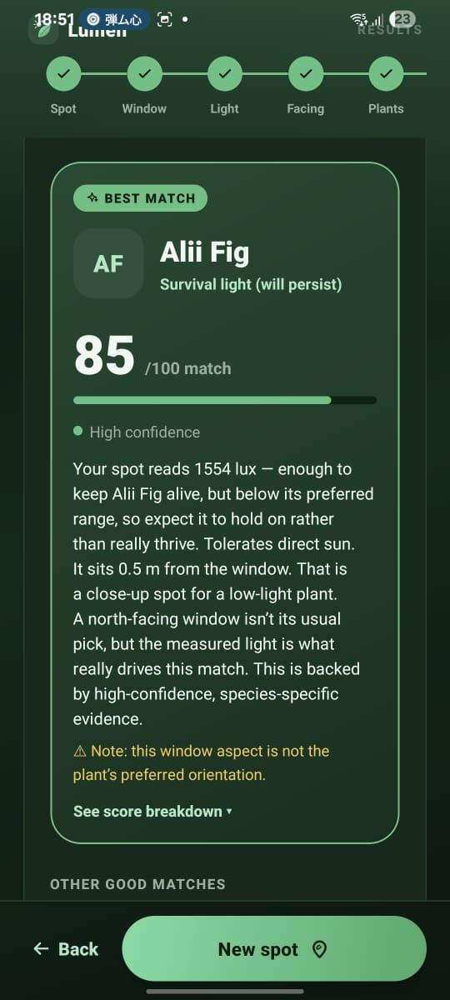
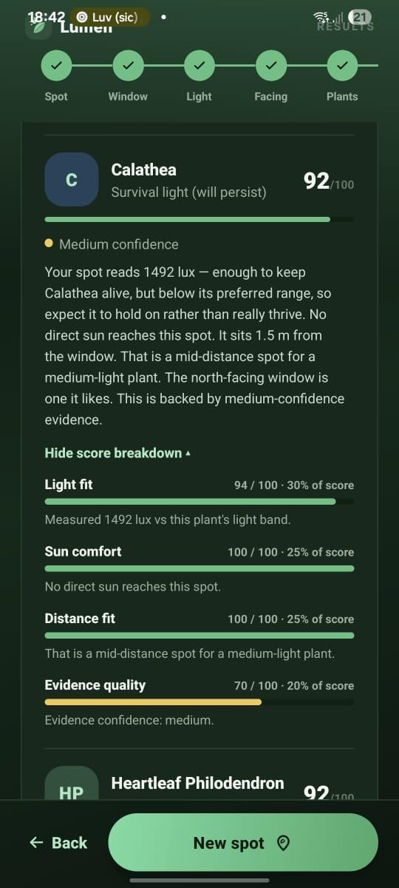
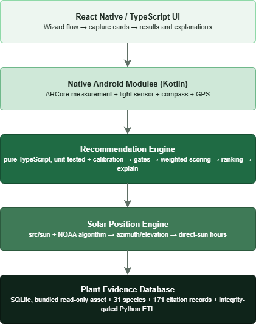

<p align="center">
  
</p>

<h1 align="center">Lumen</h1>
<p align="center"><b>An Android app that measures the light at the exact spot a plant will sit, then recommends plants that will actually survive there.</b></p>

<p align="center">
  
  
  
  
  
  
</p>

---

## The problem

Light indoors is not uniform. It can fall by an order of magnitude between a spot right beside a window and a spot three steps back. Yet almost every plant-care app sorts an entire room into one label: **low, medium, or bright.** Two very different spots get the same answer, and none of them ask whether direct sun ever reaches the spot at all.

**Lumen measures the actual spot instead of the room.** It reads real lux at that exact location with the phone's own sensor, measures the distance to the window with the camera, and calculates whether direct sunlight will hit that spot at all. All three measurements feed into an explainable rule engine that ranks 31 evidence-backed plant species by fit.

This was validated with real field data, not a synthetic benchmark: **70 measurement sessions across 15 real windows over 3 months**, cross-checked against a professional lux meter and a tape measure.

## Results

| Metric | Result |
|---|---|
| Light-sensor accuracy vs. a professional lux meter | **99.6%** (210 paired readings, r = 0.996) |
| AR camera distance accuracy vs. a tape measure | **within ±9 cm** (30 field spots) |
| Independent correctness check of the recommendation engine | **620 / 620** decisions matched an oracle re-derived from raw plant evidence |
| Real sessions where a room-label app would give the wrong answer the whole time | **59%** of 70 field sessions, where light genuinely changed with distance but never crossed the app's own category boundary |
| Manual end-to-end test cases passed | **37 / 38** |
| Automated unit tests | **118**, all passing |

The core finding: holding the measured light constant and varying only distance and sun exposure still changes the recommendation. That proves all three inputs matter, not just a lux reading. A conventional label-based app would have returned an identical plant list in every one of those cases.

## Screenshots

<table>
<tr>
<td align="center" width="33%"><br/><sub><b>Welcome</b></sub></td>
<td align="center" width="33%"><br/><sub><b>AR distance capture</b></sub></td>
<td align="center" width="33%"><br/><sub><b>Calibrated light capture</b></sub></td>
</tr>
<tr>
<td align="center"><br/><sub><b>Window facing (compass)</b></sub></td>
<td align="center"><br/><sub><b>Direct-sun estimate</b></sub></td>
<td align="center"><br/><sub><b>Ranked best match</b></sub></td>
</tr>
<tr>
<td align="center" colspan="3"><br/><sub><b>Explainable score breakdown</b></sub></td>
</tr>
</table>

## What makes this technically interesting

- **Real sensor calibration, not a toy demo.** Phone light sensors under-read relative to professional equipment, a known and documented behaviour. Lumen derives a per-device linear correction from 210 field-collected paired readings and validates it with a held-out cross-validation split, not just an in-sample fit.
- **Spatial measurement via ARCore**, with a manual tape-measure fallback on devices without AR support. The app never locks out a user over hardware limits.
- **Solar geometry from first principles.** A NOAA-based solar position algorithm calculates the sun's azimuth and elevation for the user's exact location, date, and time, then intersects that with the AR-measured window opening to estimate direct-sun hours. No external API, no network call.
- **A fully explainable rule-based engine.** Two hard survival gates (light floor, direct-sun tolerance) followed by a weighted, four-factor suitability score (light fit, sun comfort, distance fit, evidence confidence). No machine learning, no black box. Every recommendation and every rejection carries a plain-language reason traceable to a specific rule and a specific published source.
- **An evidence-backed plant database**, built from 171 citation records across university extension services, the Royal Horticultural Society, peer-reviewed literature, and horticultural datasets. It compiles into a single versioned SQLite file through a Python ETL pipeline with an automated integrity gate: row count mismatches, orphaned foreign keys, and broken source links all fail the build.
- **Independently verified, not self-graded.** The engine's decisions were checked against a second, separately written oracle program that re-derives the expected answer straight from the raw evidence. Result: 620/620 agreement, with zero shared logic between the two implementations beyond the specification itself.

## Architecture

<p align="center">
  
</p>

Key files, if you want to dig in:

| Layer | Path |
|---|---|
| Decision engine | [`src/engine/`](src/engine): `gates.ts`, `scoring.ts`, `lightFit.ts`, `calibration.ts`, `recommend.ts`, `explain.ts` |
| Solar position | [`src/sun/solar.ts`](src/sun/solar.ts) |
| AR / sensor capture | [`src/ar/arMeasurement.ts`](src/ar/arMeasurement.ts), [`src/sensor/`](src/sensor) |
| Native Android bridge | [`android/app/src/main/java/com/plantarapp/`](android/app/src/main/java/com/plantarapp) |
| Plant database build | [`tools/export_to_sqlite.py`](tools/export_to_sqlite.py) |

## Tech stack

**App:** React Native 0.85, TypeScript, React 19
**Native:** Kotlin (ARCore, `SensorManager`, `LocationManager`, SQLite bridge)
**Data:** SQLite (bundled, read-only), Python (`openpyxl`) for the ETL/build step
**Testing:** Jest, with unit coverage across calibration, scoring, gating, and sensor-processing logic

## Getting started

### Prerequisites

- [Node.js](https://nodejs.org/) ≥ 22.11
- JDK 17 and [Android Studio](https://developer.android.com/studio) (SDK Platform 36, `minSdkVersion` 24)
- A physical Android device is strongly recommended. AR measurement, the light sensor, and the compass cannot be meaningfully tested on an emulator.

### Clone and install

```bash
git clone https://github.com/hanz02/lumen.git
cd lumen
npm install
```

### Run it

```bash
# Start Metro (the JS bundler) in one terminal
npm start

# Build and install on a connected device or emulator, in another terminal
npm run android
```

The plant evidence database (`plant_db.sqlite`, 31 species and 171 records) is already bundled as an Android asset, so the app runs immediately. No separate data setup needed.

### Running the tests

```bash
npm test
```

### Rebuilding the plant database (optional)

The database is generated from source spreadsheets that aren't part of this repository. `tools/export_to_sqlite.py` is included to show the build process, including the integrity gate that checks row counts, cross-references, and citation links before allowing a build to succeed. Running it requires the original evidence workbooks.

## License

MIT. See [LICENSE](LICENSE). Free to use, learn from, and build on.

## Background

Lumen began as a Final Year Project (B.Eng. Software Engineering) exploring whether commodity phone sensors, augmented reality, and solar geometry could be combined into a single, explainable indoor-plant recommendation system. This repository contains the application codebase. The accompanying research and field evaluation are documented separately.

---

<p align="center">
  <a href="https://github.com/hanz02">GitHub</a> ·
  <a href="mailto:khawhanzhe@gmail.com">Email</a> ·
  <a href="https://hanz02.github.io/hanz-portfolio/">Portfolio</a> ·
  <a href="https://hanz02.github.io/crap-portfolio/">UI Work</a>
</p>
