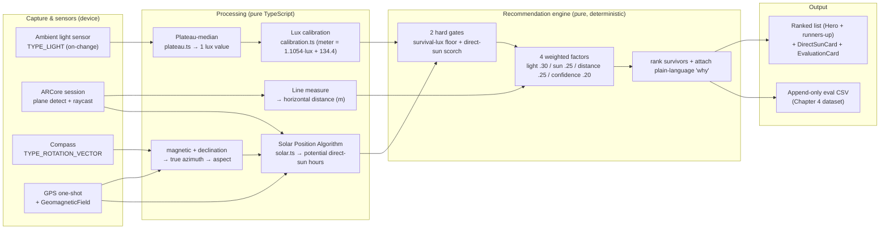
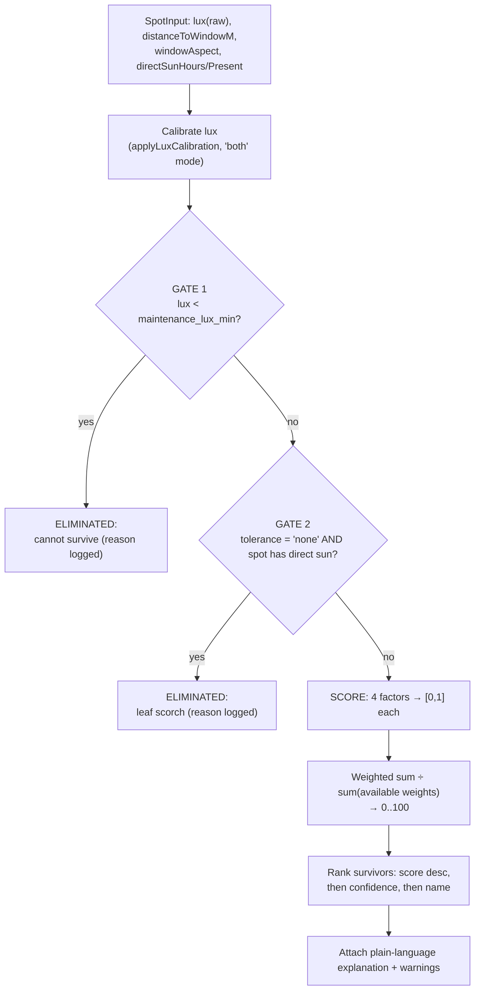
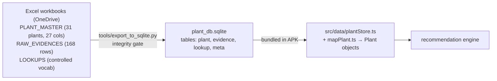

# Lumen — Full Project Handoff for Thesis Writing (Chapters 1 & 3, with guidance for 2/4/5)

> **To: Claude (chat).** You are being handed a complete, built Final-Year-Project
> software system. Your job is to help the author write **Chapter 1 (Introduction)**
> and **Chapter 3 (Research Methodology)** of the thesis, and to advise on Chapters
> 4 and 5. This document is the authoritative, low-level description of what was
> actually built. Read it fully before writing. Where it points at source files,
> ask the author to paste them if you need exact wording — but everything you need
> to write Ch1 and Ch3 at a high standard is here.
>
> **From: Claude Code**, the agent that implemented and verified the system on the
> author's machine. I have read every engine/sensor/SPA file in this repo. The
> numbers, constants, and algorithms below are taken from the real code, not the
> design notes.

---

## 0. READ THIS FIRST — the three things you must get right

### 0.1 The objective has CHANGED since the FYP 1 proposal — this is load-bearing for Chapter 1

The FYP 1 proposal (the PDF/DOCX the author will upload to you) framed Objective (ii)
as **"compare a rule-based technique against a hybrid (ML) technique."** That hybrid
model was **never built**, and building it would have *contradicted* the project's
real contribution. The thesis objective has been **reframed** to:

> **"Does measuring the actual conditions at a specific placement spot — illuminance
> (lux) + plant-to-window distance (AR) + potential direct-sun exposure (Solar
> Position Algorithm) — produce more differentiated, spot-specific, and explainable
> plant recommendations than the fixed-label ('low / medium / bright') approach used
> by existing indoor-plant apps (e.g. Green Oasis)?"**

**What this means for your Chapter 1 writing:**
- **Reuse the proposal's Chapter 1 *background, problem statement, and motivation*** —
  they are still valid (indoor plants die from wrong light; existing apps use vague
  static labels; there is a gap).
- **Rewrite the objectives and scope** to match the system that was actually built.
  Do **not** carry over the "rule-based vs hybrid/ML comparison" objective. Replace it
  with the measured-spot-vs-fixed-label framing above.
- Be explicit (in your own notes to the author, not necessarily in the thesis) that
  this is a deliberate, defensible scope change: the dataset is small (31 plants) and
  **explainability is a hard requirement**, so a rule-based + weighted-scoring engine
  is the *correct* methodological choice, not a limitation. A trained ML model on 31
  rows would be indefensible and unexplainable.
- The author is **integrity-obsessed**. Every dataset value traces to a URL source;
  there are **no hand-tuned constants** (all are derived by scripts or are stated
  design decisions). Mirror this tone: claim only what the system does, flag every
  limitation. Do **not** let the writing over-claim (see §0.3).

### 0.2 What to write, in priority order
1. **Chapter 3 (Research Methodology)** — the largest, most technical chapter. This
   is where the project shines. §3–§9 below are written specifically to be
   transcribed into Chapter 3.
2. **Chapter 1 (Introduction)** — reuse proposal background + new objectives. §1–§2
   and §10.1 below.
3. Guidance for **Ch4 (Results/Evaluation)** and **Ch5 (Conclusion)** — §10.3–§10.4.

### 0.3 Hard guardrails (the author will reject writing that breaks these)
- **Lux is the runtime measurement unit.** The app measures **lux**. It does **NOT**
  measure PPFD / PAR / DLI. PPFD/DLI may appear only as *scientific framing* in the
  literature review — never claim the app measures them.
- **AR distance is reliable; AR window-size is prototype/approximate.** Say so.
- **The SPA outputs *potential* direct sun** (clear-sky, unobstructed assumption).
  Never call it "measured" or "actual" sun. Always "potential."
- **No trained ML model exists.** Do not imply one.
- **Every recommendation is explainable** — that is the point, not a feature.

---

## 1. What the system is (for Chapter 1 §"Project Overview")

**Lumen** is a mobile application (React Native front-end + native Android Kotlin /
ARCore modules) that recommends indoor plants for a **specific placement spot inside
a room**, not for a whole room.

**The gap / novelty:** existing recommenders (Green Oasis, Doshi's PRES, Jaishree's
hybrid, Das's cosine-similarity system) decide using **static light labels** ("low /
medium / bright") or regional weather. Lumen instead **measures the actual light in
lux at the chosen spot**, measures **how far that spot is from the window** (AR), and
estimates **whether and when direct sun can reach it** (Solar Position Algorithm), and
matches all three against **evidence-based, plant-specific light thresholds** with an
**explainable rule-based + weighted-scoring engine.**

The key behavioural claim: *the recommendation changes as you move the phone around
the room*, because the measured conditions change. Fixed-label apps cannot do this.

---

## 2. The objective change spelled out (for Chapter 1 §"Objectives")

Suggested thesis objectives (aligned with what was built):

1. **To design and develop** a mobile system that captures the *measured* light (lux),
   *measured* spot-to-window distance (AR), and *computed* potential direct-sun
   exposure (SPA) at a specific indoor placement spot.
2. **To design an explainable recommendation engine** that matches those measured
   spot conditions against evidence-based, plant-specific light thresholds (with
   per-plant evidence-confidence weighting) and produces a ranked, *justified* plant
   list.
3. **To evaluate** whether measuring spot-specific conditions yields more
   differentiated and spot-appropriate recommendations than the fixed-label approach
   used by existing apps, and to validate the measurement instruments (phone-lux vs a
   reference lux meter; AR distance vs a tape measure).

Research questions that fall out of this (good for Ch1 and Ch3):
- **RQ1:** Can a consumer phone measure spot illuminance reliably enough (after
  calibration) to drive plant suitability decisions?
- **RQ2:** Does incorporating AR distance and SPA direct-sun materially change the
  recommendation, or is the output secretly driven by lux alone?
- **RQ3:** Does the measured-spot approach differentiate spots that a fixed-label
  approach treats as identical?

(RQ2 and RQ3 are already answered with evidence — see §9 and the IV/DV harness.)

---

## 3. System architecture (Chapter 3 §"System Overview")

Four independent capture/computation "assembly lines" feed one scoring engine.



**Diagram asset:** a rendered version of this exists at
`tools/report/img/01_architecture.png` (ask the author to upload it).

**Critical design property:** the engine (`src/engine/`) and the SPA (`src/sun/`) are
**pure functions** — no React, no I/O, no device dependency. Given the same inputs they
always produce the same output. This is why the system is fully unit-tested (101
passing tests) and why the *same code* runs on-device and inside the evaluation
harness. Emphasise this in Ch3 as a methodological strength (reproducibility).

---

## 4. Tech stack & repository map (Chapter 3 §"Development Tools" + appendix)

- **Front-end:** React Native — `App.tsx` is the step-wizard shell and all `useMemo`
  glue that wires sensors → engine → UI.
- **Native Android bridge modules (Kotlin):** `ARModule.kt`, `ARPackage.kt`,
  `CompassModule.kt`, `LocationModule.kt`, `EvalLogModule.kt`, `PlantDataModule.kt`,
  `MainApplication.kt`.
- **AR core:** `ARMeasurementActivity.kt` (~1,500 lines) — ARCore via the Gorisse
  Sceneform fork 1.23.0 (plane detection, raycast/hit-test, anchors).
- **Reference instruments:** UNI-T **UT383** lux meter; **Samsung Galaxy S21+** phone;
  a tape measure.

**`src/` (TypeScript) — the files Chapter 3 should cite:**

| Area | Files | What to read it for |
|---|---|---|
| Engine | `src/engine/{config,types,gates,lightFit,scoring,calibration,explain,recommend}.ts` | The whole recommendation algorithm (§7). `config.ts` = every tuning constant. |
| SPA / sun | `src/sun/solar.ts` | Solar position + direct-sun aperture model (§5). |
| Sensors | `src/sensor/{lightSensor,plateau,useLightCapture,compass,useCompassCapture,cardinal}.ts` | Lux capture + plateau reduction; compass. |
| Location | `src/location/location.ts` | GPS one-shot + declination. |
| Data | `src/data/{plantStore,mapPlant}.ts` | Loads the bundled SQLite, maps rows → `Plant`. |
| Eval | `src/eval/{evalRow,evalLog}.ts` | The Chapter-4 CSV schema. |
| AR bridge | `src/ar/arMeasurement.ts` | The typed wrapper over the native AR module. |
| UI | `src/components/*` `src/ui/*` | Step cards + design system (only if you write a UI section). |

**Tests** (proof the methodology works): `src/**/__tests__/*.test.ts` — 101 tests
across 10 suites (engine, SPA, plateau, calibration, eval, mapPlant, cardinal,
circular-mean, App).

---

## 5. The Solar Position Algorithm & direct-sun model (Chapter 3 §"Sunlight Interpretation")

**File:** `src/sun/solar.ts` (pure TypeScript, unit-tested against ephemeris values).

### 5.1 Solar position
`solarPosition(epochMs, latDeg, lonDeg)` implements the **NOAA General Solar Position
Calculations** (Meeus-based), returning `{azimuthDeg, elevationDeg, declinationDeg,
equationOfTimeMin}` to ~±0.01°. Chapter 3 should **cite Reda & Andreas (2004)** as the
reference SPA and justify this lighter formulation by an **accuracy-requirements
argument**:

> 0.01° is ~3 orders of magnitude finer than the 90° window-aspect sectors and the
> ~5–10° error of a phone compass, so the full NREL coefficient tables would add no
> *usable* precision. (This is a strong, examiner-proof justification — use it.)

### 5.2 What the SPA answers
It does **not** predict lux. It answers: *"could direct sun reach this window/spot, and
when?"* Output is always labelled **POTENTIAL** direct sun (assumes a clear,
unobstructed sky; real obstructions only reduce it).

### 5.3 Two models
- `estimateDirectSun(date, lat, lon, windowAzimuth)` — orientation-only fallback: at
  each 5-min sample, the sun "counts" if elevation ≥ `minElevationDeg` (3°) and its
  azimuth is within `maxIncidenceDeg` (85°) of the window's facing.
- `estimateDirectSunThroughAperture(date, lat, lon, windowAzimuth, aperture)` — the
  **spot-specific** model, and the **only place the AR window dimensions enter any
  computation.** Inputs: `widthM`, `sillM`, `topM (= sill+height)`, `distanceM`, and a
  signed `lateralOffsetM` (where the plant sits along the window width). Two tests per
  5-min sample:
  1. **Azimuth cone** — the sun's *signed* azimuth deviation from the window normal
     must fall between the window's two edges *as seen from the (possibly off-centre)
     plant*: `atan((−W/2 − x)/d) − margin  ≤  dev  ≤  atan((+W/2 − x)/d) + margin`,
     where `x = lateralOffsetM`, `d = distance`, margin = `azMarginDeg` (6°). At `x = 0`
     this reduces to the symmetric `±(atan(W/2/d)+margin)` cone.
  2. **Vertical penetration band** — the sun-beam height at the plant,
     `[sillM − d·tan(α), topM − d·tan(α)]` (α = elevation), must overlap the plant's
     `[0, assumedPlantTopM ± vertMarginM]` extent (plant-top 0.4 m, margin 0.1 m).

  Passing samples are clustered into `SunInterval{startMin,endMin}` and summed into
  `hours`.

- `daylightWindow(date, lat, lon)` — first/last minute the sun is above the floor;
  used to draw the sun's full path even when 0 h reach the spot.

**Constants (defend in Ch3):** `DIRECT_SUN_PARAMS = { minElevationDeg: 3,
maxIncidenceDeg: 85, sampleStepMin: 5 }`; `APERTURE_PARAMS = { azMarginDeg: 6,
vertMarginM: 0.1, assumedPlantTopM: 0.4 }`.

**Lateral-offset honesty note (important):** lateral plant position is a **geometric
refinement justified by trigonometry + unit tests, not by field-measured lux.** The
vertical test deliberately stays on the perpendicular distance (the lateral slant is
below the margins). Frame it in Ch3 as improving the *geometric fidelity* of the
*potential* estimate — **not** as field-validated accuracy.

**Citations for the aperture margins:** Szerman et al. (2014) and LBNL daylighting
rules (the margins keep the geometry honest against AR/compass error rather than
implying false precision).

**Diagram:** `tools/report/img/07_spa.png` (sun path + aperture geometry).

---

## 6. Lux capture & calibration (Chapter 3 §"Illuminance Measurement")

### 6.1 Capture & plateau reduction
**Files:** `src/sensor/lightSensor.ts`, `src/sensor/plateau.ts`,
`src/sensor/useLightCapture.ts`.

Android's `TYPE_LIGHT` is an **on-change** sensor (it only fires when the value
changes — silence means "value held"). Capture flow:
1. Native module streams `TYPE_LIGHT` events to JS; each is timestamped with
   `Date.now()` on arrival (one clock for the capture controller).
2. After a 10-second guided capture, `extractPlateauReading(samples, endMs)`:
   - **Hold-last-value resample** onto a uniform 10 Hz grid (`resampleStepMs = 100`).
   - **Plateau segmentation:** a new segment starts when a sample deviates from the
     running segment median by more than `max(10%, 30 lx)` (`relTol = 0.1`,
     `absTolLux = 30`).
   - Returns the **median of the longest stable plateau** (later plateau wins ties),
     or `null` if no plateau reaches `minPlateauMs = 1000` (then the UI asks for a
     retry rather than guessing).
3. The returned lux is **RAW** (uncalibrated) and carries quality metadata
   (`good`/`fair`, plateau ms, coverage, spread %).

**Methodological strength to highlight:** the *same* plateau criterion is used offline
in `tools/extract_phone_readings.py`, so Chapter 3 can describe **one** segmentation
criterion for both the runtime and the offline dataset extraction.

**Diagram:** `tools/report/img/08_plateau.png`.

### 6.2 Calibration ("both" mode)
**File:** `src/engine/calibration.ts`, constants in `src/engine/config.ts`.

The phone sensor under-reads. A linear regression over **210 paired field readings**
(Samsung S21+ vs UNI-T UT383, Apr–May 2026) gives:

```
calibrated_lux = 1.1054 × phone_lux + 134.4          (r = 0.996, R² = 0.993)
```

- "**Both** mode": `SpotInput.lux` stays RAW; the engine applies calibration at scoring
  time; every `Recommendation` carries both `luxRaw` and `luxUsed`.
- **Range guard:** below `validMinLux = 200 lx`, the large intercept over-predicts
  wildly (a real 15 lx reading would become 151 lx), so the **raw value is returned
  unchanged** below 200 lx. Validated range is 200–6000 lx.
- These constants are regenerated **only** by `tools/analyze_spot_observations.py` —
  never hand-tuned. (Say this in Ch3; it is a credibility point.)

**Diagram:** `tools/report/img/03_calibration.png`.

---

## 7. The recommendation engine — low-level algorithmic flow (Chapter 3 §"Recommendation Engine" — the centrepiece)

**Files:** `src/engine/` — `recommend.ts` orchestrates; constants in `config.ts`.

`recommend(plants, spot)` is a pure function. Pipeline per plant:



### 7.1 Gates (`gates.ts`) — policy = "lux floor + direct-sun only"
Only two hard eliminations exist:
- **Gate 1 — survival floor:** `spot.lux < plant.maintenance_lux_min` → eliminate.
- **Gate 2 — scorch:** `plant.direct_sun_tolerance === 'none'` AND `spotHasDirectSun(spot)`
  → eliminate. `spotHasDirectSun` = `directSunPresent === true` OR
  `directSunHours ≥ DIRECT_SUN_HOURS_THRESHOLD (1.0)`.
- **Window orientation is deliberately NOT a gate** — only a scoring/explanation
  factor. Gating on it would contradict the thesis spine (measured spot lux beats
  static labels). **This is a key methodological decision to defend in Ch3.**

**Diagram:** `tools/report/img/05_gate_logic.png`.

### 7.2 The four weighted factors (`scoring.ts`) — `WEIGHTS = light .30 / directSun .25 / distance .25 / confidence .20`

1. **Light fit** (`lightFit.ts`, `lightFitScore`): piecewise [0,1].
   - `lux < maintenance_lux_min` → 0 (also gated).
   - `lux > preferred_lux_max` → 0.7 (bright excess; possible stress).
   - `lux ≥ preferred floor` → 1.0.
   - between floor and preferred → ramps `0.6 + 0.4·((lux−floor)/(good−floor))`.
   - `preferredFloor = preferred_lux_min ?? maintenance_lux_max ?? preferred_lux_max`
     (handles the sparse-threshold reality of the dataset honestly).
   - **Diagram:** `tools/report/img/04_light_fit.png`.
2. **Direct-sun comfort** (`directSunFactor`): from `direct_sun_tolerance` × SPA hours.
   - `tolerant` → 1.0 always.
   - `some` → 1.0 if no sun OR hours ≤ `SOME_TOLERANCE_HOURS_OK (3.0)`, else 0.6.
   - `none` → 1.0 if no direct sun, else 0.2 (and Gate 2 usually eliminates first).
   - `unknown` → 0.6 (cautious neutral).
   - If no sun data captured → `available: false` (dropped, weights renormalised).
3. **Distance fit** (`distanceFactor`): AR distance → zone, crossed with the plant's
   light class via the `ZONE_CLASS_FIT` matrix:

   | zone \ class | high | medium | low |
   |---|---|---|---|
   | **near** (≤1.0 m) | 1.0 | 0.7 | 0.4 |
   | **mid** (≤2.5 m) | 0.7 | 1.0 | 0.7 |
   | **deep** (>2.5 m) | 0.4 | 0.7 | 1.0 |

   Light class by `maintenance_lux_min`: low ≤ 800, medium ≤ 5000, else high. Idea:
   high-light plants belong near the window; low-light plants prefer to be set back.
   If no AR distance → `available: false`. **Diagram:** `tools/report/img/09_distance_matrix.png`.
4. **Evidence confidence** (`confidenceFactor`): `CONFIDENCE_SCORE` = high 1.0 /
   medium 0.7 / low 0.45 / provisional 0.3. Propagates dataset uncertainty into the
   score so a shaky-evidence plant can never out-rank a solid one on a tie.

### 7.3 Weighted sum + renormalisation
```
score = ( Σ available factors: weight·value ) / ( Σ available weights ) × 100
```
If an optional input (SPA, AR distance) is missing, that factor's weight is dropped
and the **remaining weights are renormalised**, so partial captures score honestly;
the result is flagged `recommendationConfidence = 'reduced'`. **Diagram:**
`tools/report/img/06_scoring.png`.

### 7.4 Ranking & explanation
- Sort survivors by **score desc → confidence rank → common name**.
- `explain.ts` builds a plain-language **"why"** per plant from the four factors plus
  a `displayWarning` (sun risk / low-confidence / proxy-evidence note). **Every
  recommendation is explainable — this is non-negotiable and is the project's
  defensibility spine.**

---

## 8. The data pipeline & the dataset (Chapter 3 §"Dataset Construction" — the data contribution)

The evidence-based plant dataset is the project's **data contribution**. Authored in
Excel (OneDrive, not the repo), exported to a bundled SQLite.



- **Per plant:** `maintenance_lux_min/max` (survival range), `preferred_lux_min/max`
  (ideal/ornamental range), `direct_sun_tolerance` (none/some/tolerant/unknown),
  `final_confidence` (high/medium/low/provisional), `aspect_orientation` (N;E;S;W).
- **Two threshold levels per plant** (maintenance vs preferred) is an intentional
  decision — the engine distinguishes "stays alive" from "thrives."
- **Integrity gate:** `export_to_sqlite.py` aborts the build on any violation (row
  counts, orphan FKs, missing evidence refs, LOOKUP-code compliance, empty source
  URLs). Every value traces to a URL-accessible source. **Stress this in Ch3.**
- **Field light dataset (calibration source):** 210 paired observations = 70 sessions
  × 3 distances (50/100/150 cm); Pearson r = 0.996; fit `1.1054·x + 134.4`
  (R² = 0.9928). Tools: `enrich_spot_master.py`, `analyze_spot_observations.py`.
  Manual `SPOT_OBSERVATIONS` readings are final; plateau re-extraction is an
  independent QA cross-check only (never overwrites master data).

---

## 9. Evaluation — what's already done and how to write Chapter 4 (§"Evaluation Design & Results")

This is the part where the objective change becomes an *advantage*. The author already
built an **IV/DV evaluation harness** that runs the *real engine* on the *real 31-plant
database*. **You should base Chapter 4 on its outputs.**

**Files:** `tools/eval/ivdv_evaluation.test.ts` (Jest harness running the real engine),
`tools/eval/output/{variables,part1_verification,part2_comparison}.md` (paste-ready
machine-generated results), and `tools/eval/output/Lumen_Evaluation_Report.docx`
(plain-language version with 8 diagrams).

### 9.1 Variables (operationalised — put this table in Chapter 3 and/or 4)
- **Independent variables:** IV1 = measured spot lux; IV2 = AR plant-to-window
  distance; IV3 = SPA potential direct-sun (hours/presence). Window aspect + window
  geometry are **upstream** IVs (they feed IV3, not the score directly).
- **Dependent variables:** recommended set, ranking, 0–100 suitability score, gate
  outcome, recommendation confidence.

### 9.2 Part 1 — proof the engine genuinely uses distance & sun (answers RQ2)
Holding lux **constant at 3000 lx** and varying only distance + sun produced **8 → 30 →
8** recommendations across three spots (near+sun / deep+no-sun / mid+some-sun). A
lux-only system would have returned the same list all three times. It did not →
distance and sun are **load-bearing**, not decorative.

### 9.3 Part 2 — measured-spot vs fixed-label baseline (answers RQ3)
An isolated `scoreLabelGuessed(lux)` baseline mirrors fixed-label apps (Photone global
bands: low 1–4,000 / medium 4,000–11,000 / full 11,000–32,000 lx; lux only; unranked).
Run on the real field triplets:
- **The sun axis is the unbreakable argument:** lux cannot encode *direct* sun, so two
  2000 lx spots (north shade vs west window with 3 h sun) get the *same* label list but
  the engine drops scorch-prone plants from the sunny one.
- **The distance axis:** lux falls off with distance (median to ~34% from 50→150 cm),
  but stays inside **one** Photone band ~**55%** of the time. In those 55% the
  fixed-label method is **blind**; the measured engine still differentiates in **89%**
  of them (median **11 of 31** plants differ). Across all sessions the engine
  differentiates in ~49% that the label method cannot.

**Honest framing (use this):** the *sun* axis alone justifies the measured approach;
*distance* adds scoring value but is partially redundant with lux. Say both.

### 9.4 Instrument validation (also Chapter 4)
- **Phone-lux vs UT383:** r = 0.996, R² = 0.993 (the calibration regression).
- **AR distance vs tape:** the eval CSV has `ref_tape_cm`; the author collects pairs
  on-device (the `EvaluationCard` makes this one tap). Distance is the reliable AR
  output; window-size is approximate (report both honestly).
- The eval CSV (`src/eval/evalRow.ts`) also logs `plant_lateral_offset_m`,
  `capture_sun_elevation_deg` (to filter night/dusk rows), and a tapped
  `sky_condition` (weather context — never an engine input).

---

## 10. Proposed thesis structure & chapter-by-chapter guidance

### 10.1 Chapter 1 — Introduction
Reuse from the proposal: background (indoor plants & light), problem statement
(existing apps use vague static labels; people place plants in unsuitable spots), and
significance. **Replace** the objectives/scope with §2 above. Add the three research
questions (§2). Add a short "scope & limitations" paragraph that honestly states: lux
not PPFD; AR distance reliable / window-size prototype; SPA is potential sun; 31-plant
dataset; Android-only; single reference device (S21+).

### 10.2 Chapter 2 — Literature Review (already drafted)
The author reports Ch2 is done. Ensure it covers: existing recommenders (Green Oasis /
Angel et al. 2025, PRES/Doshi, Jaishree's hybrid, Das), light metrics (lux vs PPFD/PAR/
DLI — and why lux is the practical runtime unit), Solar Position Algorithms (Reda &
Andreas 2004; Meeus), and AR measurement limitations. If you touch it, align
terminology with this document.

### 10.3 Chapter 3 — Research Methodology (write this from §3–§8 above)
Recommended section order:
1. Research design (developmental / engineering research + an evaluation study).
2. System architecture & overview (§3, diagram 01).
3. Data capture: illuminance + plateau (§6.1, diagram 08); AR distance (§4/§5.3);
   compass + GPS → true azimuth (§5.1); SPA & aperture model (§5, diagram 07).
4. Lux calibration (§6.2, diagram 03).
5. Recommendation engine: gates → factors → weighting → ranking → explanation (§7,
   diagrams 04/05/06/09).
6. Dataset construction & integrity pipeline (§8).
7. Evaluation design: IV/DV operationalisation, Part 1 & Part 2, instrument
   validation (§9).
8. Tools, constants table (§11), and reproducibility (pure functions + 101 tests).

**Strongest methodological selling points to foreground:** (a) measured-not-labelled
spine; (b) pure/deterministic engine ⇒ reproducible + the same code evaluates itself;
(c) every constant is a stated design decision or script-derived (no hand-tuning); (d)
full explainability; (e) honest scoping of AR and SPA.

### 10.4 Chapter 4 — Results & Evaluation (write from §9)
Lead with Part 1 (engine genuinely multi-factor), then Part 2 (vs fixed-label), then
instrument validation (calibration r/R², AR-vs-tape). Use the `tools/eval/output/*.md`
numbers verbatim and the 8 diagrams in `tools/eval/docx_build/img/`. Be candid about
the distance-vs-lux partial redundancy.

### 10.5 Chapter 5 — Conclusion & Future Work
- **Contributions:** the measured-spot method; the explainable engine; the
  evidence-based 31-plant dataset; the calibration + evaluation methodology.
- **Limitations:** lux-only (no DLI integration over time); AR window-size accuracy;
  SPA is clear-sky potential; compass susceptible to metal-frame interference; small
  dataset; single device/OS.
- **Future work:** more plants; multi-device calibration; time-integrated light (DLI)
  via repeated captures; empirical validation of the lateral-position refinement;
  cloud-cover-aware sun discounting; iOS port.

---

## 11. Key constants (Chapter 3 appendix / methodology defence table)

| Constant | Value | Meaning | File |
|---|---|---|---|
| WEIGHTS.light / directSun / distance / confidence | 0.30 / 0.25 / 0.25 / 0.20 | factor weights | `config.ts` |
| DISTANCE_ZONES near / mid | ≤1.0 m / ≤2.5 m | distance zones | `config.ts` |
| LIGHT_CLASS low / medium | ≤800 lx / ≤5000 lx | plant light class | `config.ts` |
| CONFIDENCE_SCORE | 1.0 / 0.7 / 0.45 / 0.3 | evidence weighting | `config.ts` |
| DIRECT_SUN_HOURS_THRESHOLD | 1.0 h/day | counts as "direct sun present" | `config.ts` |
| SOME_TOLERANCE_HOURS_OK | 3.0 h/day | comfort limit for 'some' tolerance | `config.ts` |
| LUX_CALIBRATION slope / intercept | 1.1054 / 134.4 | phone→meter regression | `config.ts` |
| LUX_CALIBRATION validMin / validMax | 200 / 6000 lx | calibration valid range | `config.ts` |
| DIRECT_SUN_PARAMS minElevation / maxIncidence / step | 3° / 85° / 5 min | SPA thresholds | `solar.ts` |
| APERTURE_PARAMS azMargin / vertMargin / plantTop | 6° / 0.1 m / 0.4 m | aperture margins | `solar.ts` |
| PLATEAU relTol / absTol / step | 10% / 30 lx / 100 ms | plateau segmentation | `plateau.ts` |

---

## 12. References already embedded in the system (cite these in Ch2/Ch3)
- **Reda, I. & Andreas, A. (2004).** Solar position algorithm — the reference SPA.
- **Meeus, J.** Astronomical Algorithms — basis of `solarPosition`.
- **NOAA** General Solar Position Calculations — the implemented equations.
- **Szerman et al. (2014)** + **LBNL** daylighting rules — aperture-margin justification.
- **Angel et al. (2025), *Green Oasis*** — the fixed-label baseline the engine is
  compared against.
- **Photone** — the global lux-band convention used for the fixed-label baseline.
- **Zhang (2023)** — supporting evidence used in the dataset (PLANT_MASTER).
- Instruments: **UNI-T UT383** lux meter; **Samsung Galaxy S21+**.

---

## 13. My advice & wisdom (Claude Code → Claude chat, and to the author)

1. **Lead every chapter with the one-sentence thesis:** *"Measure the actual light,
   distance, and sun at the exact spot, and match it to evidence-based plant
   thresholds with an explainable engine — instead of guessing from a vague label."*
   Everything else supports this sentence.
2. **Turn the objective pivot into a strength, not an apology.** The right line is:
   *"On building the system it became clear that a trained hybrid/ML model on a
   31-plant evidence dataset would be neither defensible nor explainable; the
   objective was therefore refined to evaluate measured-spot vs fixed-label
   recommendation — a comparison that directly tests the project's core hypothesis."*
3. **Never let the prose over-claim.** If you catch yourself writing "the app
   measures sunlight/PPFD/DLI," stop — it measures **lux** and **computes potential**
   sun. The author *will* notice and reject it.
4. **Use the existing artifacts.** Two finished Word documents already exist and are
   gold: `tools/report/Lumen_Technical_Report.docx` (deep technical, 10 diagrams —
   essentially a Chapter-3 quarry) and `tools/eval/output/Lumen_Evaluation_Report.docx`
   (Chapter-4 quarry, 8 diagrams). Ask the author to upload both to you; reuse the
   diagrams and numbers rather than inventing any.
5. **Methodology must be reproducible on paper.** Describe the algorithms precisely
   enough that a reader could reimplement them from Chapter 3 alone — the pseudocode in
   §5 and §7 is at the right level; expand it into prose + numbered steps.
6. **Pre-empt the obvious examiner questions:** *Why lux not PPFD?* (phone-readable,
   practical; PPFD/DLI out of scope, stated). *Why rule-based not ML?* (small dataset,
   explainability). *Isn't distance just lux?* (partly — answered with data in §9.3;
   the sun axis is the clean win). *How accurate is the phone sensor?* (r=0.996 after
   calibration, within a stated range). *Isn't AR window-size unreliable?* (yes — stated
   prototype; distance is the reliable output).
7. **Ask the author for the FYP 1 proposal and the current thesis draft** before
   writing Chapter 1, so you reuse the exact background wording and citation style and
   only swap the objectives.
8. **Keep the integrity tone throughout** — measured vs computed vs assumed are three
   different words; use them precisely.

---

## 14. Files & artifacts checklist for Claude chat to request from the author
- The **FYP 1 proposal** (PDF/DOCX) — for Chapter 1 background reuse.
- The **current thesis draft** (Chapter 2, and any Ch1 skeleton).
- `tools/report/Lumen_Technical_Report.docx` + the 10 PNGs in `tools/report/img/`.
- `tools/eval/output/Lumen_Evaluation_Report.docx` + the 8 PNGs in
  `tools/eval/docx_build/img/`.
- `tools/eval/output/{variables,part1_verification,part2_comparison}.md`.
- If exact code wording is needed: `src/engine/config.ts`, `src/engine/scoring.ts`,
  `src/engine/gates.ts`, `src/engine/lightFit.ts`, `src/sun/solar.ts`,
  `src/sensor/plateau.ts`, `src/eval/evalRow.ts`.

*End of handoff. Build Chapter 3 from §3–§9, Chapter 1 from §1–§2 + the proposal, and
Chapters 4–5 from §9–§10. Keep it measured, explainable, and honest — exactly like the
system.*
